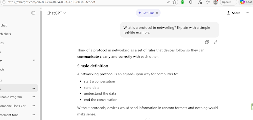
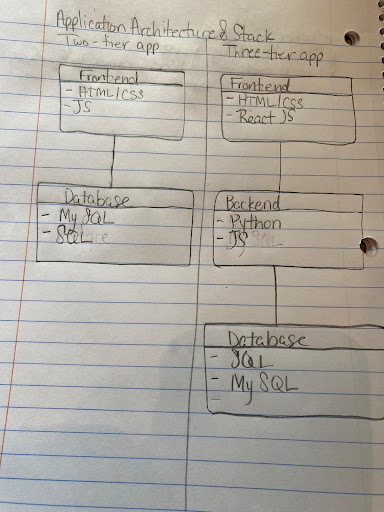
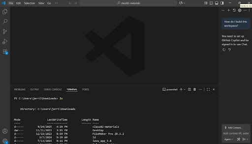

# Week 00 - Internet and Networking

Part of the DevOps Micro Internship (DMI) Cohort 3 with Agentic AI

---

# 🧑‍💻 Task 1: Using ChatGPT as Your Learning Assistant

## Scenario

You're new to DevOps and will frequently encounter technical questions. ChatGPT can be your learning companion.

## Your Task

Write a clear ChatGPT prompt to help you understand:

> "What is a protocol in networking? Explain with a simple real-life example."

Take a screenshot of your interaction showing:

* Your detailed prompt (with clear expectations)
* ChatGPT's simplified response with an example

## Screenshot

Save your screenshot in the `screenshots` folder and update the file name below.




---

## What I Learned (2–3 lines)


I learnt that protocol is a set of rules use for communication over the network
It is a laid down mode of interaction devices use to execute command just like humans use language to understand each other, devices need protocol to understand each command

---

# 🌐 Task 2: Internet and Networking

## Scenario

Your friend is launching an online bookstore named **EpicReads**.

He asked you to explain how users globally can access his website hosted in Finland.

## Your Task

Write a short explanation (**100–150 words**) that includes:

* Packet Switching
* IP Address
* TCP/IP
* HTTP/HTTPS

💡 **Tip:** You may use ChatGPT (as demonstrated in Task 1) to refine your explanation.

## Answer

Users around the world can access the EpicReads website in Finland because of how the internet routes and delivers data. When someone enters the website URL, their device sends a request that travels through the internet using packet switching, where information is broken into small packets and sent across different network paths. Each device involved in this journey is identified by an IP address, which ensures the packets know exactly where to go. The packets move using the TCP/IP protocol suite: TCP ensures reliable delivery, while IP handles addressing and routing. Once the request reaches the server in Finland, the website is delivered back to the user through HTTP or HTTPS, with HTTPS adding encryption for secure browsing.


---

# 🏗️ Task 3: Application Architecture & Stack

## Scenario

EpicReads bookstore has two application versions:

### Two-Tier Application

* Frontend
* Database

### Three-Tier Application

* Frontend
* Backend
* Database

## Your Task

* Draw simple diagrams (hand-drawn or tool-based such as draw.io)
* Label each layer clearly
* List at least two common technologies or tools used for each layer
* Submit a screenshot or photo clearly showing your own drawing

## Diagram Screenshot / Photo

Save your diagram image in the `screenshots` folder and update the file name below.




---

## Technologies Used

### Frontend

* HTML/CSS
* JS

### Backend

* JS
* Python

### Database

* MySql
* Sql

---

# 🌍 Task 4: Domain Name & DNS (Basic Concepts)

## Scenario

Your friend's bookstore **EpicReads** is currently accessible through:

```text
52.172.142.222:3000
```

He purchased the domain:

```text
epicreads.com
```

## Your Task

In **50–100 words**, explain in your own words:

1. What is DNS (Domain Name System)?
2. Which DNS record type should be used to connect the domain to the given IP, and why?

## Answer


The DNS technology works like the internet’s address book. Instead of expecting people to remember a long IP address like 52.172.142.222:3000, it lets them type a simple name such as epicreads.com. When someone enters that domain, DNS looks up the correct IP and sends them to the right server. To connect the EpicReads domain to its server, he should use an A record, because it directly maps a domain name to an IPv4 address, making the website easy for anyone to reach.


---

# 💻 Task 5: Visual Studio Code Setup (Hands-on)

## Your Task

Install Visual Studio Code (if not already installed).

Take a screenshot of your VS Code environment showing:

* Terminal open inside VS Code
* Running a basic command:

### Windows

```powershell
dir
```

### Linux / macOS

```bash
pwd
ls
```

* Your selected VS Code theme clearly visible

⚠️ **Important:** The screenshot must show your username or another identifiable detail to confirm it is your environment.

## Screenshot

Save your screenshot in the `screenshots` folder and update the file name below.




---

# 🔗 Task 6: Publish Your Assignment as a LinkedIn Post

## Objective

Publishing on LinkedIn helps you:

* Build your professional online presence
* Reinforce your learning
* Document your DevOps journey publicly

## Your Task

Summarize your answers from Tasks 1–5 into a LinkedIn post.

Clearly structure your post into the following sections:

* ChatGPT
* Internet & Networking
* App Architecture
* DNS
* VS Code Setup

Add the following credit note at the end of your post:

> **P.S. This post is part of the DevOps Micro Internship (DMI) with Agentic AI — Cohort 3 — by Pravin Mishra. My graded progress is public: https://dmi.pravinmishra.com/s/YOUR-GITHUB-USERNAME.html · Start your DevOps journey: https://dmi.pravinmishra.com/?utm_source=student&utm_medium=ps-linkedin&utm_campaign=cohort3**

---

## LinkedIn Post URL


https://www.linkedin.com/posts/jlvalentine80_my-first-week-in-the-devops-microinternship-activity-7424857507183120384-jFWq?utm_source=share&utm_medium=member_desktop&rcm=ACoAAALB3J0BwtFufEKpichQKK5s_jlChwTdfk8


```text

```

---

## LinkedIn Post Backup Copy

My First Week in the DevOps Micro‑Internship: A Small Step, Big Shift

During the internship, I started by exploring how tools like ChatGPT can serve as a thinking partner—breaking down complex ideas, helping me reason through problems, and making learning feel less intimidating.
As I dug deeper, the internet itself began to make more sense. I finally understood how a simple website request travels across the world through packet switching, IP addresses, and the TCP/IP model. Even the difference between HTTP and HTTPS clicked in a way it never had before.
Then came application architecture. Visualizing how apps are structured—whether two‑tier or three‑tier—gave me a clearer picture of how real systems are built and scaled. It’s one thing to use apps every day; it’s another to understand what’s happening behind the scenes.
DNS was another eye‑opener. Realizing it works like the internet’s phonebook made everything less abstract. Connecting a domain to an IP suddenly felt straightforward instead of mysterious.
And finally, I set up my VS Code environment properly—configuring Git with my name and email so my commits actually reflect my identity. A small detail, but it made me feel like I’m stepping into the world of real developers.
This week wasn’t just about learning concepts—it was about seeing how all the pieces fit together. And honestly, it feels good to be building something meaningful, one step at a time.
P.S.
This post is part of the FREE DevOps Micro Internship Cohort run by Pravin Mishra. You can start your DevOps journey for free from his YouTube Playlist.


---

# Reflection – Week 0

### What did you find easy?


The foundational networking and internet concepts were highly straightforward.

The material covered basics that aligned closely with my existing knowledge.

Navigating the initial environment setup required very little effort.

---

### What was difficult?


Designing the complete three-tier architecture for the EpicReads bookstore application.

Mapping human-readable domains to server IPs using different DNS records.

Getting comfortable working directly inside the terminal using Linux navigation commands.

---

### What will you improve next week?

Deepen my command-line efficiency as I move past basic Linux navigation.

Apply these foundational networking concepts to more complex deployment scenarios.

Scale my understanding of app architecture as the internship moves into phase two.

---

## 📌 About DMI & CloudAdvisory

DevOps Micro Internship (DMI) is a project-based DevOps program run by Pravin Mishra (The CloudAdvisory) focused on real-world execution, systems thinking, and career readiness.

It helps learners build strong DevOps foundations with hands-on experience.


## 📌 Resources

- 🌐 **DMI Official Website:** https://pravinmishra.com/dmi  
- 🎓 **DevOps for Beginners (Udemy):** https://www.udemy.com/course/devops-for-beginners-docker-k8s-cloud-cicd-4-projects/  
- 🎓 **Ultimate Agentic AI DevOps with Clude Code** https://www.udemy.com/course/ultimate-agentic-ai-devops-with-claude-code/?referralCode=448389767BC96284087B
- 🎓 **DevOps with Claude Code: Terraform, EKS, ArgoCD & Helm** https://www.udemy.com/course/devops-with-claude-code-terraform-eks-argocd-helm/?referralCode=1C5B734505D65A010FA3
- ▶️ **YouTube Playlist (DMI Cohort 3):** https://www.youtube.com/playlist?list=PLFeSNDtI4Cho  
- 🔗 **Pravin Mishra (LinkedIn):** https://www.linkedin.com/in/pravin-mishra-aws-trainer/  
- 🏢 **CloudAdvisory (LinkedIn):** https://www.linkedin.com/company/thecloudadvisory/

---

*This submission is part of DevOps Micro Internship (DMI) Cohort 3 — Agentic AI Track*