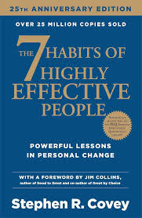
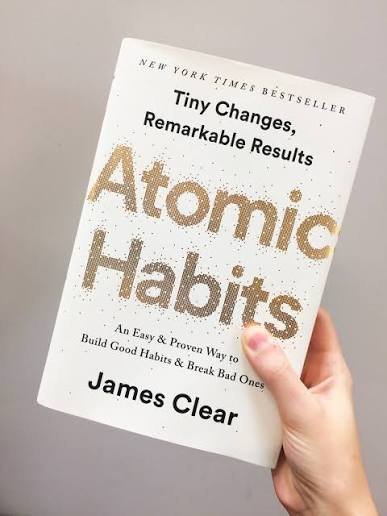
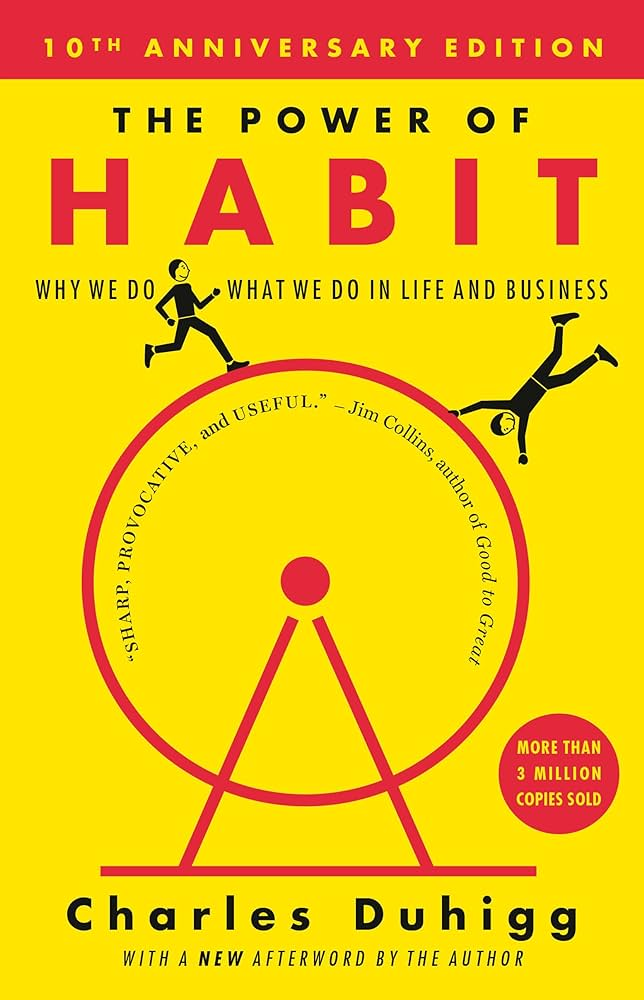
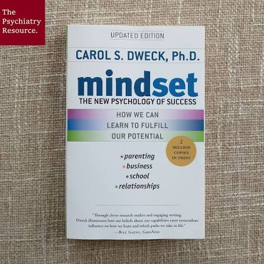
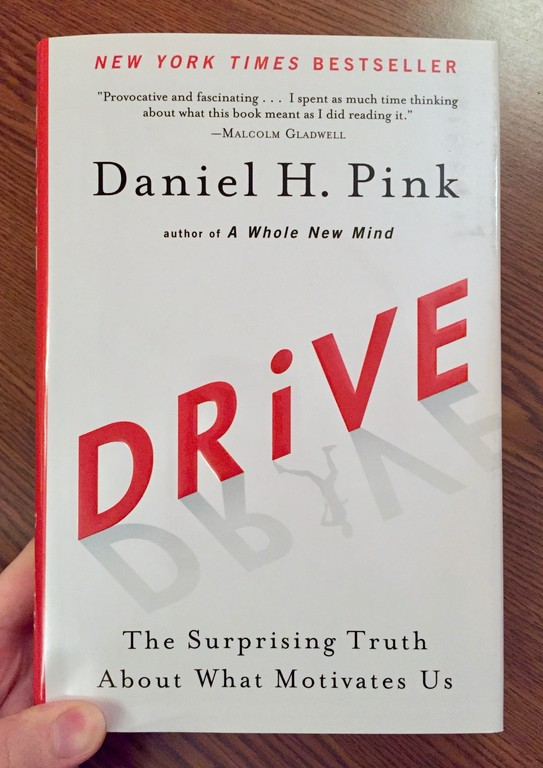
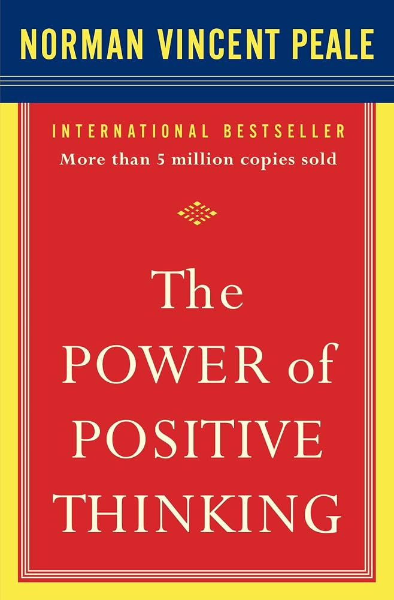

# Week 01 — Success Mindset (Mindset OS)

Part of the DevOps Micro Internship (DMI) with Agentic AI

---

## Task 1 — A Belief You Hold

### Question

What is something you believe to be true that most people around you would disagree with?

Write at least **50 words**. Be honest, specific, and use clear professional sentences.

### Your Answer

I think most people overestimate how much “passion” should drive their career and underestimate how much discipline and environment matter. I’ve seen and honestly believe that you can build a fulfilling career in something you’re not initially passionate about if it gives you growth, stability, and the right learning opportunities. Passion often follows competence, not the other way around.

A lot of people around me push the idea of “find your passion first,” but I think that advice can keep people stuck or broke, especially early on. If you instead focus on becoming skilled, reliable, and adaptable in a valuable area (like tech, systems, or cloud), you create options and those options give you the freedom to shape a life you actually enjoy.

It’s not as romantic, but it’s way more practical—and in the long run, more empowering.

---

## Task 2 — Three Objective Truths Discovered Through Experimentation

Write three objective truths you discovered through your own actions and results. For each truth, include one sentence for the truth and two to four lines of evidence from your life.

### Truth #1

**Truth**

Focused work beats scattered effort. 

**Evidence from My Life**

Add your answer here...

### Truth #2

**Truth**

Add your answer here...

**Evidence from My Life**

Add your answer here...

### Truth #3

**Truth**

Add your answer here...

**Evidence from My Life**

When I split tasks into short, clear blocks, I got more done than when I tried to work without structure.

---

## Task 3 — What Does Your 2.0 Version Look Like?

Write and publicly publish an article about your future professional self, written as if a journalist is writing about you **3–7 years from now**.

Your article must:

* Be at least **300 words**.
* Be written in the **past tense**, as if it has already happened.
* Include specific proof such as projects, portfolio, GitHub, blogs, certifications, job role, leadership, or community contribution.
* Be published on LinkedIn, Medium, WordPress, Blogspot, a personal blog, or a portfolio page.

### My Article

Paste your complete article here...

### Public Article URL

```text
Paste your published article URL here...
```

### LinkedIn Post URL

Create a LinkedIn post sharing your published article, then add the URL below.

```text
Paste your LinkedIn post URL here...
```

### Credit Note — DMI Self-Paced Engineer Track Students

Add this credit note at the end of your public article. Replace `YOUR-GITHUB-USERNAME` with your actual GitHub username.

> **P.S. This post is part of the DevOps Micro Internship (DMI) — Self-Paced Engineer Track — by [Pravin Mishra](https://www.linkedin.com/in/pravin-mishra-aws-trainer/). My graded progress is public:** https://dmi.pravinmishra.com/s/YOUR-GITHUB-USERNAME.html **· Start your DevOps journey:** https://dmi.pravinmishra.com/?utm_source=student&utm_medium=ps-blog&utm_campaign=self-paced

`#DMIByPravinMishra`

Tag [Pravin Mishra](https://www.linkedin.com/in/pravin-mishra-aws-trainer/) in your LinkedIn post.

### Credit Note — DMI Campus Students

Add this credit note at the end of your public article. Replace `YOUR-GITHUB-USERNAME` with your actual GitHub username.

> **P.S. This post is part of the DevOps Micro Internship (DMI) — Campus — by [Pravin Mishra](https://www.linkedin.com/in/pravin-mishra-aws-trainer/). My graded progress is public:** https://dmi.pravinmishra.com/s/YOUR-GITHUB-USERNAME.html **· Start your DevOps journey:** https://dmi.pravinmishra.com/?utm_source=student&utm_medium=ps-blog&utm_campaign=campus

`#DMIByPravinMishra`

Tag [Pravin Mishra](https://www.linkedin.com/in/pravin-mishra-aws-trainer/) and Lead Co-Mentor [Anjana Muthunayake](https://www.linkedin.com/in/anjana-muthunayake/) in your LinkedIn post.

---

## Task 4 — Reflection on Cutting Corners

### Question

Have you ever cut corners through unethical, dishonest, or shortcut behaviour (not necessarily illegal)? If yes, how did it make you feel?

You do not need to tell the full story. Focus on the emotions you experienced. If your answer is yes, write **50–100 words**.

### Your Answer

**Yes / No:**

<<<<<<< HEAD
Distractions have a real cost. 
### Evidence from my life
=======
Add your answer here...

**Reflection:**
>>>>>>> upstream/main

When I kept my phone silent, used one tab, and stayed off social media until the work was finished, I was more productive and less overwhelmed.

---

## Task 5 — Your One-Year Non-Fiction Reading Plan

List **10 non-fiction books** you plan to read during the next year. Include the title and author of each book. Books in any language are allowed.

<<<<<<< HEAD
Consistency matters more than motivation.

### Evidence from my life

When I kept showing up, broke bigger goals into smaller steps, and reviewed my progress, I kept moving forward instead of stalling out.
=======
1. Add book title and author here...
2. Add book title and author here...
3. Add book title and author here...
4. Add book title and author here...
5. Add book title and author here...
6. Add book title and author here...
7. Add book title and author here...
8. Add book title and author here...
9. Add book title and author here...
10. Add book title and author here...
>>>>>>> upstream/main

---

## Task 6 — Your Life and Career Metrics

List the things you will measure regularly in your life and career. You only need to list the metric topics; do not include personal numbers.

Your list must include learning or skills, output or proof, health or energy, time or focus, and money or finance.

<<<<<<< HEAD
**Minimum 300 words.**

### Rules

* Write in past tense, like it already happened.
* Don't use "likes to / wants to / hopes to."
* Use specifics:

  * built
  * shipped
  * led
  * published
  * earned
  * relocated
  * contributed
* Include skills proof:

  * projects
  * portfolios
  * GitHub
  * blogs
  * certifications
  * job role
  * leadership
  * community contribution
* Add 1–3 images if you can (optional but powerful).

### Publish It Publicly On Any ONE

* LinkedIn
* Medium
* WordPress
* Blogspot
* Personal blog
* Portfolio page

Include this line:

> **P.S. This post is part of the DevOps Micro Internship (DMI) with Agentic AI — Cohort 3 — by [Pravin Mishra](https://www.linkedin.com/in/pravin-mishra-aws-trainer/). My graded progress is public: https://dmi.pravinmishra.com/s/YOUR-GITHUB-USERNAME.html · Start your DevOps journey: https://dmi.pravinmishra.com/?utm_source=student&utm_medium=ps-blog&utm_campaign=cohort3**

## Your Article

By 2029, Jerrica Valentine had established herself as a systems-focused technologist whose work connected cloud infrastructure with community-centered living.

Ms. Valentine, a former digital nomad based in the United States, built her career through a combination of formal certification and publicly documented technical work. She earned credentials including CompTIA Security+, AWS Solutions Architect Associate, and the Linux Professional Institute Certification, reinforcing her expertise in cloud architecture, system administration, and security practices.

Her GitHub portfolio served as a visible record of her progression. It featured infrastructure-as-code deployments using Terraform, automation scripts written in Python and Go, and fully documented home lab environments that replicated enterprise cloud systems. Several repositories were adopted as reference projects by other learners, particularly those transitioning into DevOps roles.

In 2027, she launched a technical blog focused on practical system design and learning strategies. Her articles—such as “Building a Self-Healing Home Lab” and “Automating Infrastructure for Small Teams”—gained traction among early-career IT professionals seeking hands-on guidance. The blog also reflected her emphasis on clarity, with step-by-step explanations and real-world use cases.

Professionally, Ms. Valentine advanced into a senior system administrator role, where she led efforts to modernize legacy infrastructure. She implemented automated deployment pipelines and monitoring systems that improved uptime and reduced manual intervention. Her leadership extended beyond technical execution; she mentored junior team members and contributed to internal documentation standards that improved team efficiency.

Outside of her corporate role, Ms. Valentine contributed to intentional living communities by designing lightweight digital systems. After relocating to a housing cooperative, she developed secure communication platforms and shared resource tracking tools tailored to community needs. She also organized small workshops on cybersecurity and digital literacy, helping residents better understand and manage their digital environments.

Her work consistently reflected a balance between technical precision and human-centered design. By integrating infrastructure expertise with community engagement, Ms. Valentine demonstrated a model of technology that supported both resilience and connection.


### Public Link

Paste your link here:

(https://medium.com/@jahreeka_25700/by-2029-jerrica-valentine-had-established-herself-as-a-systems-focused-technologist-whose-work-c6eb87afd455?sharedUserId=jahreeka_25700)

---

# Assignment 4. Have you ever cut corners (unethical / dishonest / shortcut behavior — not necessarily illegal)? If yes, how did it make you feel?

### Important

You don't need to write the full story.

Focus on the feeling:

* guilt
* fear
* shame
* stress
* regret
* numbness
* etc.

This is about self-awareness, not judgment.

### Answer Format

**Yes / No**

If Yes:

**What emotion did you feel?** (minimum 50–100 words)

## Answer

I felt mostly stress and regret, with a little shame mixed in. Even when a shortcut seemed harmless in the moment, it created a heavy feeling afterward because I knew I hadn’t done things the right way. The biggest part was the mental pressure constantly wondering if it would catch up to me, or if I had made the situation harder for myself later. It didn’t feel empowering at all. It felt like a temporary fix that left me more uneasy than before, and that discomfort usually reminded me why honesty and doing things properly matter.


---

# Assignment 5. What are 10 non-fiction books you plan to read in the next 1 year?

### Rules

* Mention **Title + Author**
* Any language allowed
* No fiction novels

### Tip

Choose books that improve:

* mindset
* communication
* productivity
* health
* money
* career
* leadership

## Book List

1. The 7 Habits of Highly Effective People by Stephen R. Covey

2. Atomic Habits by James Clear

3. Think and Grow Rich by Napoleon Hill

4. How to Win Friends & Influence People by Dale Carnegie

5. The Power of Habit by Charles Duhigg

6. Mindset by Carol S. Dweck

7. Drive by Daniel H. Pink

8. The Alchemist by Paulo Coelho

9. The Power of Positive Thinking by Norman Vincent Peale

10. You Are a Badass by Jen Sincero

---

# Assignment 6. What are the things you will measure regularly in your life and career?

### Rules

List topics only. No need to share numbers.

### Must Include

* Learning / skill
* Output / proof
* Health / energy
* Time / focus
* Money / finance (personal or business)

### Example

* Learning hours per week
* Deep work sessions per week
* Projects shipped / documented
* Steps / workouts
* Sleep hours
* Spending tracker

## My Metrics
=======
### My Metrics
>>>>>>> upstream/main

* Learning hours.

Skill-building progress.

Certifications completed.

Projects completed.

Portfolio updates.

Sleep quality.

Fasting/Energy levels.

Deep work time.

Focus blocks completed.

Spending and savings.
---

## Task 7 — Brain Dump and Three-Month System Plan

### Step 1 — Brain Dump (Private)

Do a private brain dump in a notebook, notes app, or document. Include everything currently on your mind, such as tasks, bills, worries, goals, pending messages, ideas, and responsibilities.

**Did you create a brain dump?**

```text
Yes / No
```

<<<<<<< HEAD
### Did You Do It?

**Yes / No**

Answer:Yes

y Weekly Routine

Mon–Thu: 60 minutes of deep work each day for studying or project work.

Mon–Thu: 15 minutes of review or flashcards after deep work.

Friday: Light catch-up, organize notes, and plan the next week.

Saturday: Longer focus block for hands-on practice, labs, or certification prep.

Sunday: Weekly review, progress check, and schedule setup for the next week.


---

## Step 2: Your 5-Month Routine + Focus Blocks

Create a simple plan you can realistically follow for the next 5 months.

### Weekly Routine

Example:

* Mon–Thu: 60 min deep work
* Sat: DMI session
* Sun: Weekly review
=======
### Step 2 — My Three-Month Routine and Focus Blocks
>>>>>>> upstream/main

#### My Weekly Routine

Weekly Routine
Mon–Thu: 60 min deep work.

Tue & Sat: DMI session.

Fri: light review and catch-up.

Sun: weekly review and planning.

Month 1
Set a steady routine.

Focus on showing up consistently.

Keep your goals small and clear.

Track what time of day you work best.

Month 2
Increase focus during deep work blocks.

Finish one small project or lab each week.

Reduce distractions more aggressively.

Review what is helping and what is wasting time.

Month 3
Build one stronger technical skill, like cloud, scripting, or DevOps basics.

Share progress weekly.

Practice explaining what you learned in simple language.

Keep your schedule realistic instead of overloading it.

Month 4
Work on consistency under pressure.

Push through tasks even when motivation is low.

Improve one weak area you keep avoiding.

Start connecting your learning to job-ready skills.

Month 5
Review your progress honestly.

Update your goals based on what actually worked.

Identify your strongest habit and keep it.

Prepare your next step with more confidence and less guesswork.

#### When Will I Complete My DMI Work? (Include Days and Time)

DMI Work:

Tuesday, Wednesday and Thursday mornings.


#### How Many DMI Work Sessions Will I Complete Each Week?

2 sessions per week.

#### My Distraction Rules

<<<<<<< HEAD
Phone on silent during focus blocks.

No social media until work is finished.

Keep only one tab open for the task.

Work in a quiet space with a clear desk.

Turn off notifications during study sessions.

Use a timer so breaks stay intentional.

Put the phone out of reach while working.

=======
* Add your answer here...
* Add your answer here...
* Add your answer here...
* Add your answer here...
>>>>>>> upstream/main

---

## Task 8 — Week 1 Reflection and Proof of Work

### Biggest Insight I Got About Myself This Week

I do my best work when tasks are broken into short, focused blocks with a clear outcome — finishing a lab, drafting an article, or completing a module made it much easier to start and keep momentum.


### My Biggest Weakness or Loop I Noticed

I open too many tabs and switch contexts when a step gets hard, which traps me in procrastination and makes sessions feel busy but produce little finished work.


### One System I Will Implement From This Week (Exact Habit and Time)

I will do a 60-minute focused block every weekday at 7:00 PM with my phone in another room, one browser tab only, and a visible timer; immediately after each block I’ll do a 10-minute review to log progress and update my task list.

### Proof of Work

**LinkedIn Post URL**

<<<<<<< HEAD
Last week, I officially started my DMI mentorship, and it already feels like an important step in my tech journey.
I am entering this mentorship with a clear mindset: take technology seriously, learn from every mistake, and keep building forward. I know growth does not happen by accident. It takes discipline, consistency, and a willingness to stay uncomfortable long enough to improve.
My background has helped me build a strong foundation for this journey, and I have spent time researching DevOps, cloud technologies, and real-world deployment practices to sharpen my understanding. That process has taught me that progress is not only about what you already know, but also about how committed you are to learning the right way.
Starting this mentorship has reminded me that every expert once began as a beginner. I am grateful for the opportunity to learn, reflect, and develop the habits that will shape my future in tech. This is just the beginning, but I am showing up ready to put in the work.

P.S. This post is a part of DevOps Micro Internship with Agentic AI Cohort-3 by [Pravin Mishra](https://lnkd.in/dKDY2rmk). You can start your DevOps journey by joining this [Discord community](https://lnkd.in/dVXFG5GS) ( https://lnkd.in/dVXFG5GS ).
hashtag#DevOps hashtag#Cloud Engineering hashtag#CloudComputing hashtag#AWS hashtag#Azure hashtag#CICD hashtag#ContinuousLearning hashtag#Terraform
=======
```text
Paste your LinkedIn post URL here...
```

**Blog / Medium / Public Article URL**

```text
Paste your published article URL here...
```
>>>>>>> upstream/main

---

## Completion Checklist

<<<<<<< HEAD
- LinkedIn Post URL:(https://www.linkedin.com/posts/jlvalentine80_devops-cloud-cloudcomputing-activity-7478581176199368705-j39G?utm_source=share&utm_medium=member_desktop&rcm=ACoAAALB3J0BwtFufEKpichQKK5s_jlChwTdfk8)  
- Blog / Medium : **ADD LINK HERE**  
=======
* [ ] All eight tasks are completed.
* [ ] All written answers are honest, specific, and written in clear professional sentences.
* [ ] Task 1 has at least 50 words.
* [ ] Task 2 includes all three truths and evidence from my life.
* [ ] Task 3 includes a 300+ word article written in past tense.
* [ ] My Task 3 article is published on an approved public platform.
* [ ] I added the correct DMI credit note and replaced `YOUR-GITHUB-USERNAME`.
* [ ] I published a LinkedIn post sharing my Task 3 article.
* [ ] Task 5 has 10 non-fiction books with titles and authors.
* [ ] Task 6 includes learning, output, health, time, and finance metrics.
* [ ] I completed the private brain dump for Task 7.
* [ ] I added a realistic three-month routine, DMI focus blocks, and distraction rules.
* [ ] I completed the Week 1 reflection.
* [ ] I added both the LinkedIn post and public article URLs under Task 8.
>>>>>>> upstream/main

---


## 📌 About DMI & CloudAdvisory

DevOps Micro Internship (DMI) is a project-based DevOps program run by Pravin Mishra (The CloudAdvisory) focused on real-world execution, systems thinking, and career readiness.

It helps learners build strong DevOps foundations with hands-on experience.


## 📌 Resources

- 🌐 **DMI Official Website:** https://dmi.pravinmishra.com?utm_source=github&utm_medium=readme  
- 🎓 **University:** https://university.pravinmishra.com?utm_source=github&utm_medium=readme  
- 💬 **Discord Community:** https://discord.pravinmishra.com?utm_source=github&utm_medium=readme  
- 📝 **Blog:** https://dmi.pravinmishra.com/blog?utm_source=github&utm_medium=readme  
- ▶️ **YouTube Playlist (DMI Cohort 3):** https://www.youtube.com/playlist?list=PLFeSNDtI4Cho  
- 🔗 **Pravin Mishra (LinkedIn):** https://www.linkedin.com/in/pravin-mishra-aws-trainer/  
- 🏢 **CloudAdvisory (LinkedIn):** https://www.linkedin.com/company/thecloudadvisory/

---

*This submission is part of DevOps Micro Internship (DMI) — Agentic AI Track*