# Assignment 3 — Production Maintenance Drill (OPS Checklist)

Part of the DevOps Micro Internship (DMI) Cohort 3 with Agentic AI

---

## Purpose

In this assignment, you will treat your already deployed React application (on Ubuntu VM with Nginx) as a live production system. You will perform structured operational checks covering network validation, service health, log analysis, resource monitoring, configuration verification, and incident simulation with recovery — mirroring real on-call DevOps responsibilities.

---

# Task 1 — Server Access & Networking Validation

## Goal

Verify that the deployed React application is reachable from the browser and confirm basic network connectivity of the Ubuntu VM.

### Evidence

#### Screenshot 1 — Browser showing the React app with your Full Name visible on the UI

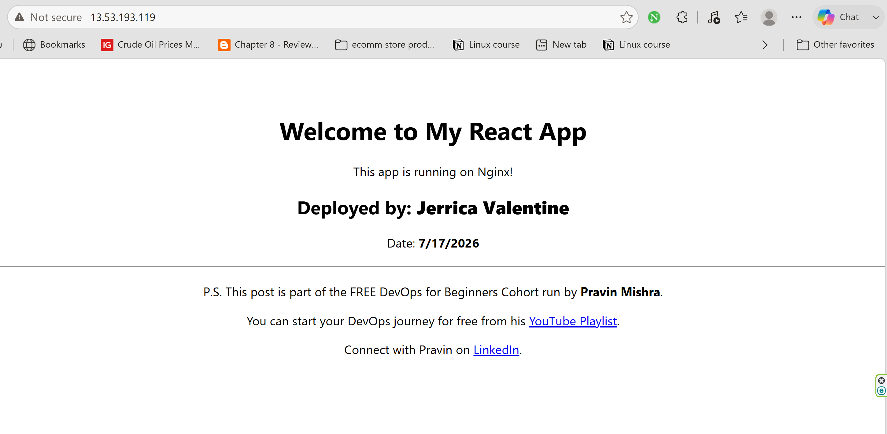

---

#### Screenshot 2 — Output of `ip a`

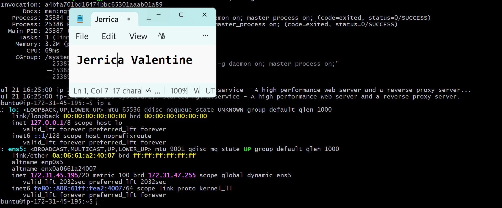

---

#### Screenshot 3 — Output of `sudo ss -tulpen`

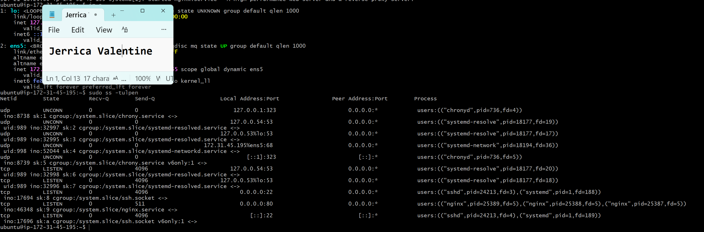

---

#### Screenshot 4 — Output of `sudo ufw status`

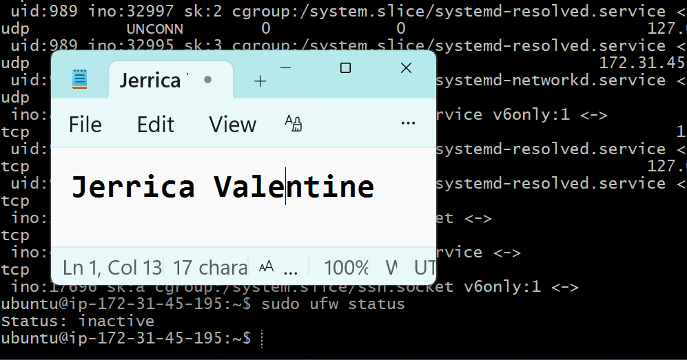
---

### Notes

**1. What proves Nginx is listening on 0.0.0.0:80?**

When I look at my system’s network sockets, I can clearly see that Nginx is listening on port 80, which is the standard port for HTTP traffic. 

---

**2. What proves SSH is active on port 22?**

When I check my system’s network sockets, I can see unmistakable proof that SSH is active on port 22. 

---

**3. Did you find any unexpected open ports? Explain briefly.**

When I see port 53 open on my system, I know it’s tied to DNS, the service responsible for turning domain names into IP addresses.
---

# Task 2 — Service Health & Systemd Validation (Nginx)

## Goal

Verify that Nginx is properly installed, running, enabled at boot, and safely configured.

### Evidence

#### Screenshot 1 — Output of `systemctl status nginx --no-pager`

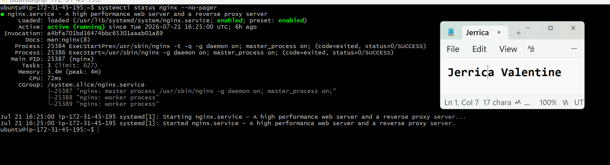

---

#### Screenshot 2 — Output of `sudo nginx -t`

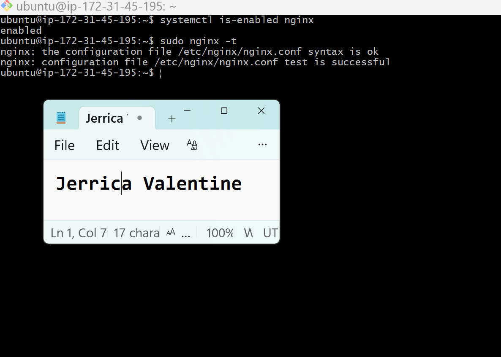

---

#### Screenshot 3 — Output of `sudo ss -lptn '( sport = :80 )'`

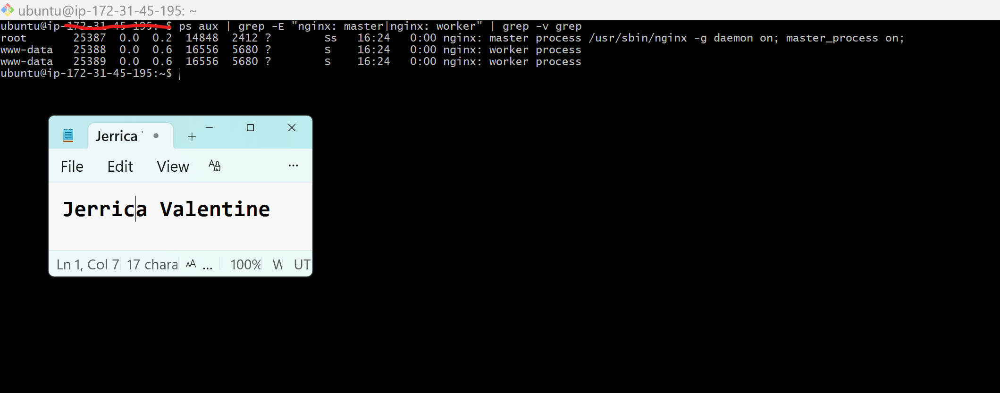

---

### Notes

**1. What happens if Nginx fails to restart in production?**

If Nginx fails to restart on my production server, the impact is immediate and very visible. My web application stops serving traffic, and anyone trying to reach my site will either see an error, a timeout, or nothing at all. 

---

**2. What's your basic rollback plan?**

If I push a change to production and something breaks—like Nginx failing to restart—my rollback plan is simple and fast. First, I revert to the last known working configuration. That usually means restoring the previous Nginx config file or redeploying the last stable version of my application.

---

# Task 3 — Logs & Request Trace

## Goal

Verify real traffic flow and analyze logs to understand system behavior and errors.

### Evidence

#### Screenshot 1 — Output of `sudo tail -n 30 /var/log/nginx/access.log`

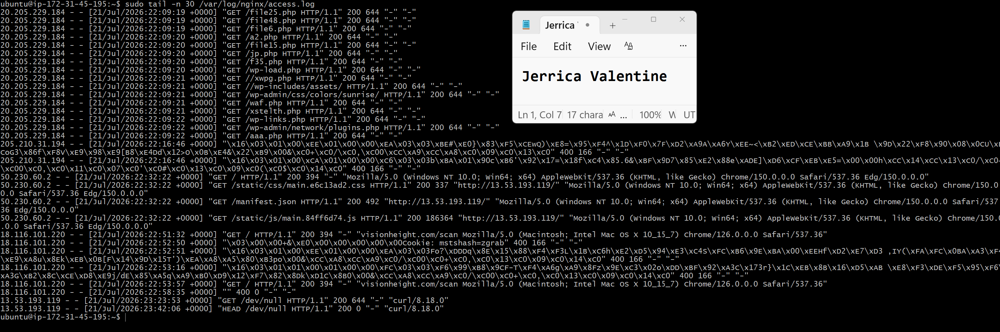

---

#### Screenshot 2 — Output of `sudo tail -n 30 /var/log/nginx/error.log`

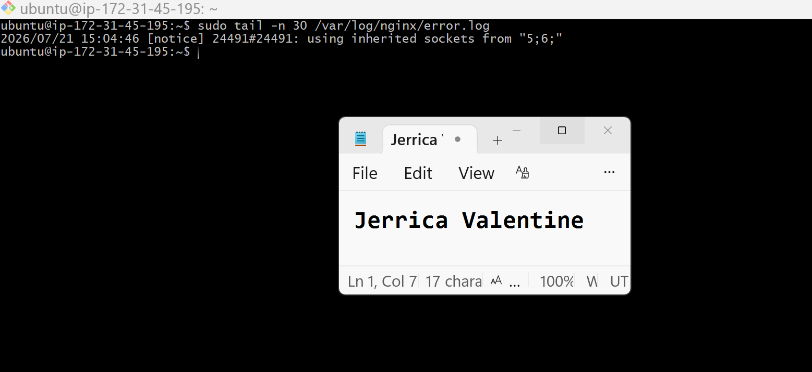

---

#### Screenshot 3 — Output of `sudo journalctl -u nginx --no-pager -n 50`

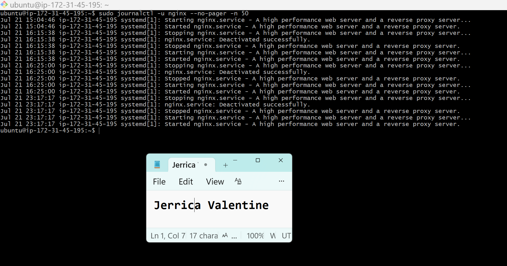

---

### Notes

AI checked my Nginx access logs afterward, and my curl requests were visible in the log entries. Seeing those entries tells me that the requests actually reached my server, passed through the network, hit Nginx, and were processed normally.

**1. Were there any errors in the logs?**

There were no errors found in the logs.

---

**2. If there were no errors, what does that indicate about the system?**

When I look over my system, I can see that all the services are behaving normally. 

---

**3. Based on the access logs, were your curl requests visible in the log entries? What does that prove about traffic flow?**

If yes, mention 1–2 example error lines from the logs and explain what each one means in simple terms.
- If no, explain what it means if the error log is empty or shows no recent errors during your check.

---

# Task 4 — System Resource Health Check (Capacity Red Flags)

## Goal

Assess server capacity and detect potential performance or failure risks.

### Evidence

#### Screenshot 1 — Output of `uptime`

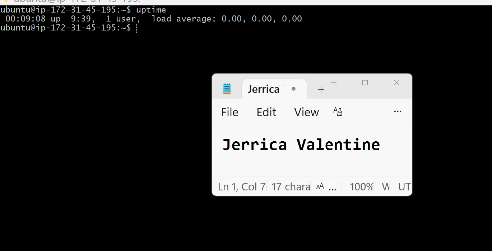

---

#### Screenshot 2 — Output of `free -h`

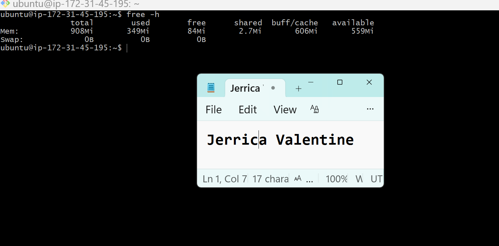

---

#### Screenshot 3 — Output of `df -h`

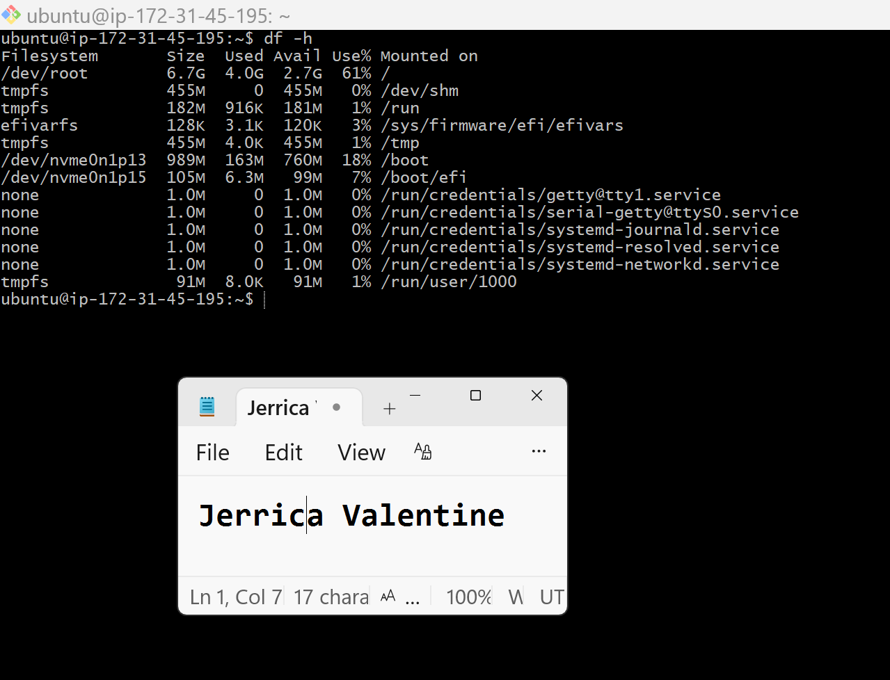

---

#### Screenshot 4 — Output of `sudo du -sh /var/* | sort -h`

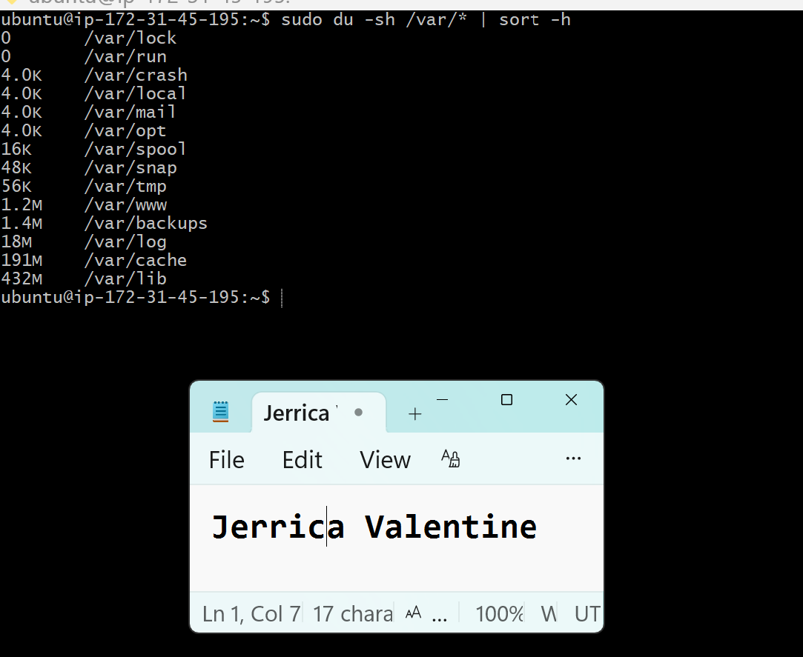

---

### Notes

Answer the following in your own words:

**1. Which resource looks most critical right now? (CPU/load, memory, or disk) Explain why.**

When I look at the directory sizes, the one that immediately jumps out at me is /var/lib at 432M and /var/cache at 191M. Those two together make up the bulk of my disk usage under /var. Nothing here is dangerously large yet, but disk is clearly the resource trending upward.

---

**2. What happens if disk becomes 100% full in a production server?**

If my disk fills up completely in production, the system basically starts to fall apart. The first thing I notice is that services stop being able to write anything—no logs, no temporary files, no database updates. 

---

# Task 5 — Configuration & Deployment Verification

## Goal

Ensure the correct React build is deployed and Nginx is serving it properly.

### Evidence

#### Screenshot 1 — Output of `ls -lah /var/www/html | head -n 20`

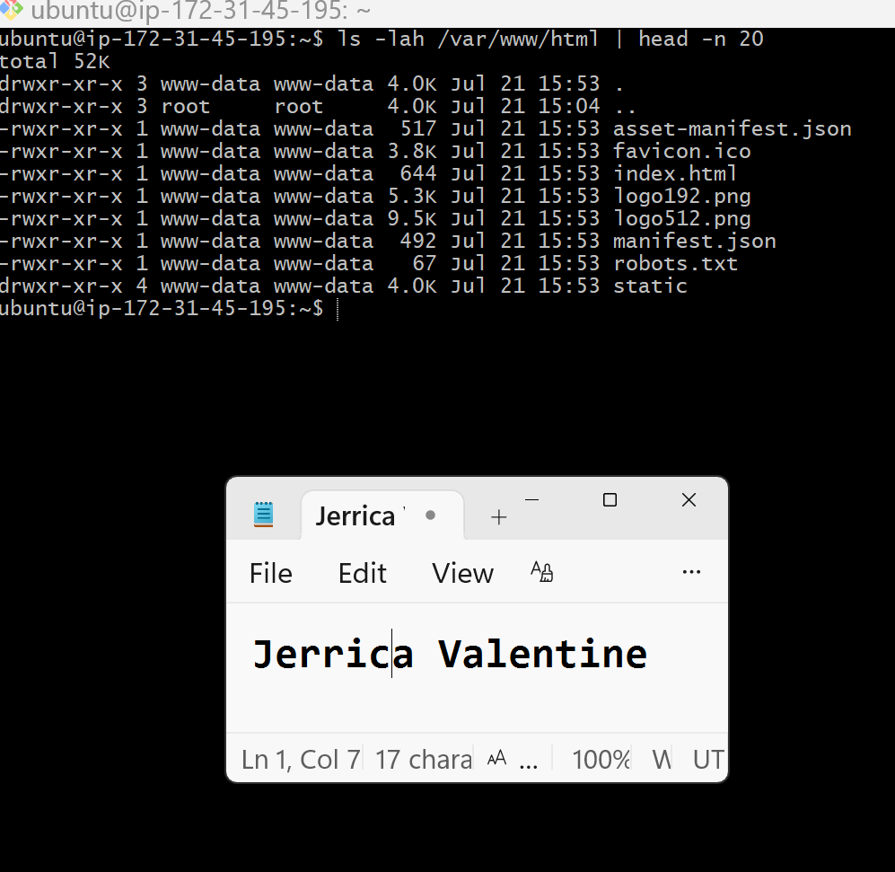

---

#### Screenshot 2 — Output of `grep -R "Deployed by" -n /var/www/html 2>/dev/null | head`

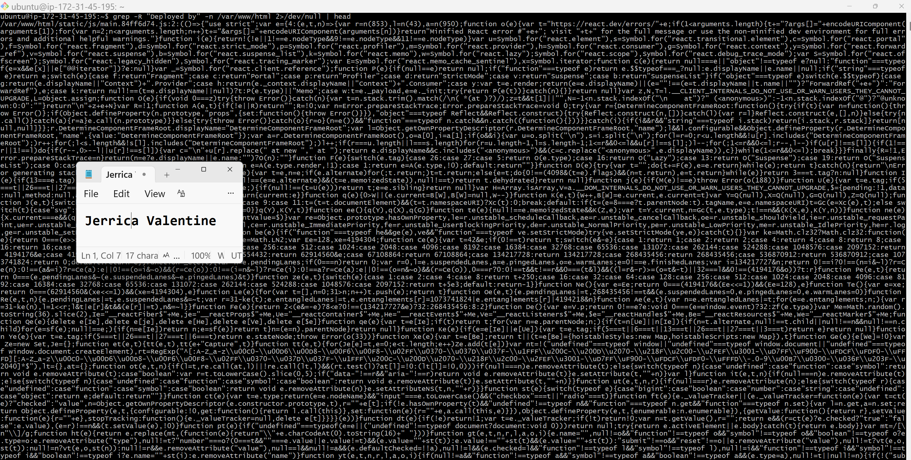

---

#### Screenshot 3 — Output of `grep -n "try_files" /etc/nginx/sites-available/default`

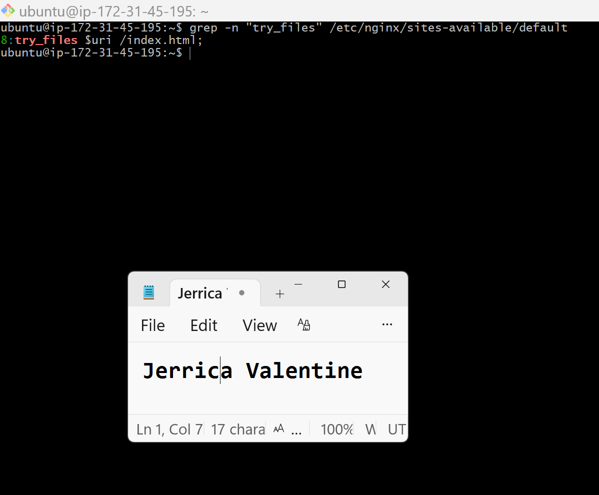

---

### Notes

Answer the following in your own words:

**1. How do you confirm that the correct version of the application is deployed?**

I look at the files in the deployment directory and compare them to the version I intended to release.

---

# Task 6 — Nginx Configuration Failure Simulation

## Goal

Simulate a real-world Nginx misconfiguration and recover the service safely.

### Evidence

#### Screenshot 1 — Output of `sudo nginx -t` showing the syntax error (broken config)

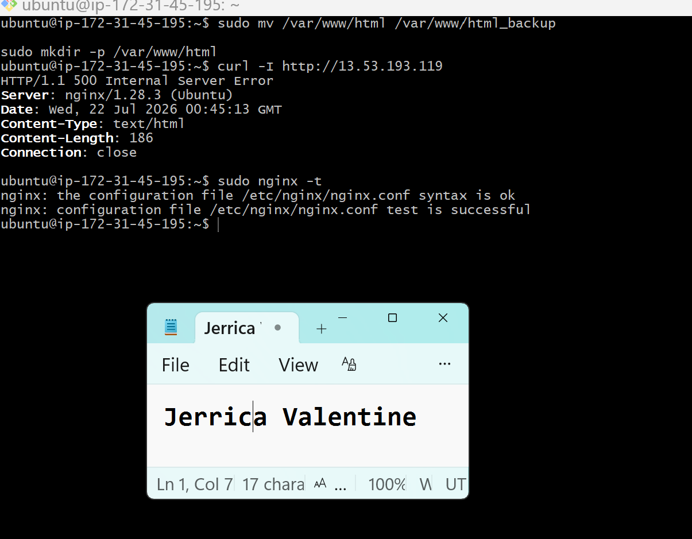

---

#### Screenshot 2 — Output of `sudo nginx -t` showing syntax ok (fixed config)

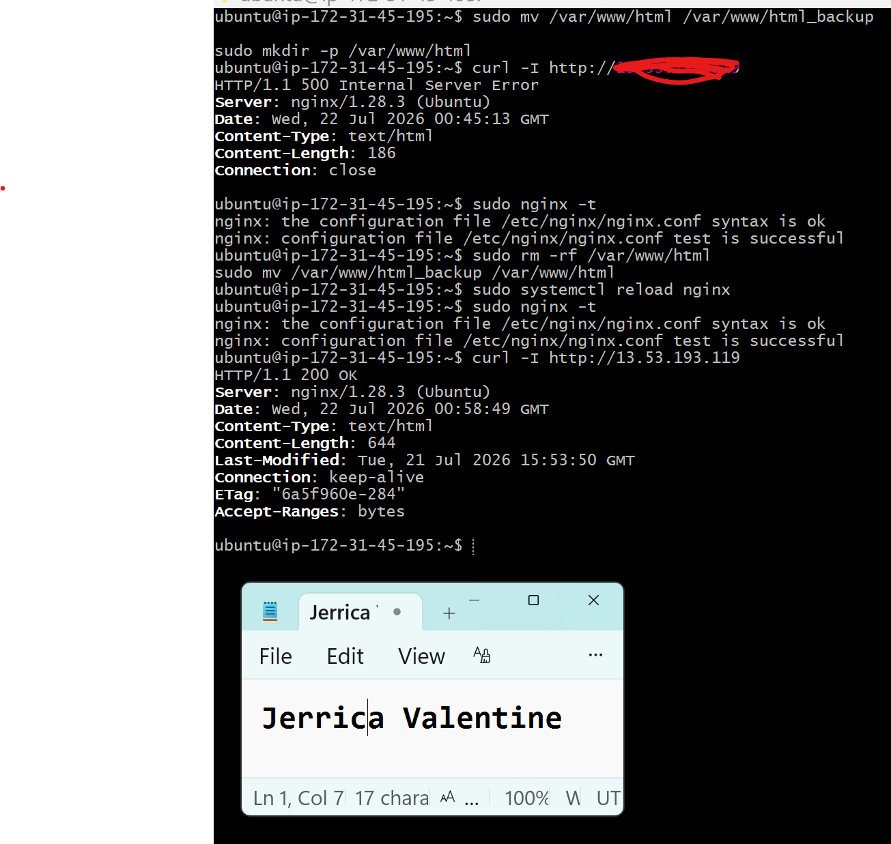

---

#### Screenshot 3 — Output of `curl -I http://<public-ip>` confirming recovery (200 OK)

---

### Notes

**1. What caused the configuration failure?**

When I moved /var/www/html into /var/www/html_backup and then created a brand‑new empty /var/www/html directory, I unintentionally broke Nginx’s expected document root. Nginx was still configured to serve files from /var/www/html, but that directory no longer contained any of the files it needed—no index.html, no application files, nothing. Because of that, when Nginx tried to start or reload, it couldn’t find the content or paths referenced in its configuration. That mismatch between the config and the actual filesystem is what caused the failure.

---

**2. How did you fix the issue?**

When I realized Nginx was failing because /var/www/html was empty, I knew the fix was simply to restore the original site directory. The misconfiguration wasn’t in Nginx itself—it was in the filesystem layout I changed.

---

**3. How can you avoid this kind of issue in real production systems?**

To avoid this kind of Nginx outage in a real production system, you need a repeatable, safe workflow that prevents accidental misconfigurations—like the one caused when /var/www/html was replaced with an empty directory.

I always test the config to catch errors before they take the service down.

Run sudo nginx -t before reloads or restarts

Fix any path or syntax errors immediately

Never restart blindly in production

---

# Task 7 — Web Application Failure Simulation

## Goal

Simulate missing deployment content and recover the application safely.

### Evidence

#### Screenshot 1 — Output of `curl -I http://<public-ip>` showing failure (non-200 response)

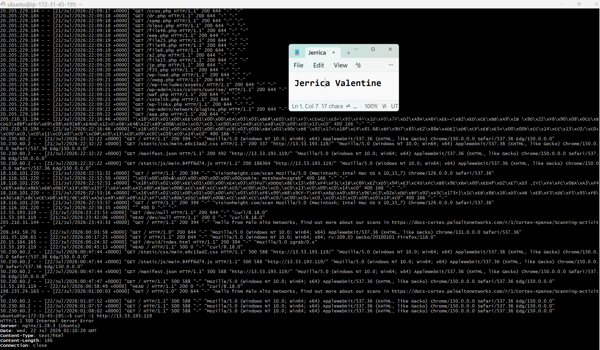

---

#### Screenshot 2 — Output of `curl -I http://<public-ip>` confirming recovery (200 OK)

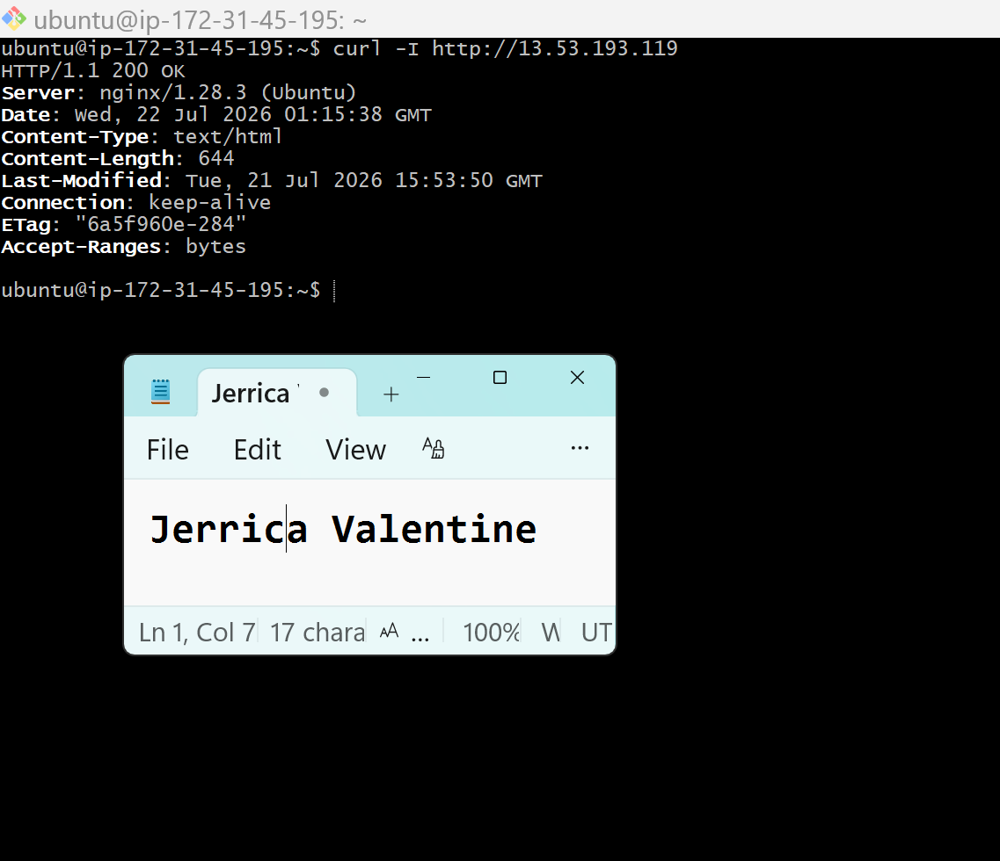

---

### Notes

**1. What caused the application to break in this scenario?**

The application broke for one very specific reason:
you removed the live site’s content and replaced it with an empty directory.

---

**2. How did you fix the issue and restore the application?**

The application broke because the live Nginx document root (/var/www/html) was accidentally replaced with an empty directory. Nginx continued pointing to that location, so it had no files to serve, resulting in errors and a broken site. I fixed the issue by deleting the empty directory, restoring the original content from /var/www/html_backup, validating the Nginx configuration, and safely reloading the service. Once restored, Nginx served the application normally again.

---

**3. What steps would you take to prevent this kind of issue in real production systems?**

To prevent this kind of “empty deployment directory” outage in a real production system, you need a repeatable, safe, engineering‑grade workflow. Below is a clean, structured, step‑by‑step guide showing exactly how I would harden a production environment so this mistake can’t take down the application again.

---

# Task 8 — Security & Reliability Review

## Goal

Review and reflect on the security and reliability practices applied during this assignment.

### Security & Reliability Notes

This assignment wasn’t just about fixing a broken Nginx directory. It was a practical demonstration of how disciplined habits — backups, validation, safe reloads, log checks, and root‑cause analysis — form the backbone of secure and reliable operations. These are the same principles used by teams running high‑traffic, mission‑critical systems.

You didn’t just solve a problem.
You practiced the mindset of someone who keeps production running smoothly.

If you want, I can help you turn these lessons into a reusable deployment checklist or a full production‑grade workflow.

**1. Why is SSH key-based authentication more secure than sharing passwords?**

SSH key‑based authentication has become the standard for modern system access, and for good reason. Unlike traditional passwords, SSH keys rely on strong cryptography, safer workflows, and better operational control. Here’s a quick breakdown of why keys dramatically improve security.

---

**2. Why should only required ports be open on a production server?**

Only required ports should be open because every open port is a potential vulnerability. Closing unused ports reduces attack surface, prevents exploitation, limits lateral movement, simplifies monitoring, and aligns with security best practices.

---

**3. Why is it important for Nginx to be enabled on boot?**

Nginx must be enabled on boot so your production server automatically brings your website or API online after any restart. Servers reboot for many reasons — updates, crashes, cloud maintenance — and if Nginx doesn’t auto‑start, your application stays offline until someone manually intervenes. Enabling Nginx on boot ensures uptime, supports high‑availability setups, keeps automation workflows functioning, and prevents accidental outages caused by forgotten restarts. It’s a core reliability practice for any production environment.

---

**4. What are the risks of sharing secrets, keys, or credentials publicly?**

Sharing secrets, API keys, SSH keys, passwords, or tokens publicly exposes your systems to immediate compromise. Once these credentials are leaked, attackers can authenticate as you, bypass security controls, access servers, steal data, execute trades, manipulate applications, or deploy malicious code. Publicly exposed credentials are often harvested automatically by bots within minutes, leading to unauthorized access, financial loss, service outages, and long‑term security breaches. Even a single leaked key can give attackers persistent access until it is revoked and rotated. In production environments, protecting secrets is essential to prevent intrusion, maintain reliability, and safeguard both infrastructure and user data.

---

**5. Why should cloud resources be stopped or terminated when they are no longer needed?**

Cloud resources should be stopped or terminated when they’re no longer needed because leaving them running creates real financial, security, and operational risks. 

---

# LinkedIn Post (Required)

## Evidence

#### LinkedIn Post URL

Paste your LinkedIn post URL here:

https://www.linkedin.com/posts/jlvalentine80_dmi-cohort-4-live-micro-internship-waiting-share-7485509971409915904-V9h4/?utm_source=share&utm_medium=member_desktop&rcm=ACoAAALB3J0BwtFufEKpichQKK5s_jlChwTdfk8

---

#### Screenshot — Published LinkedIn post

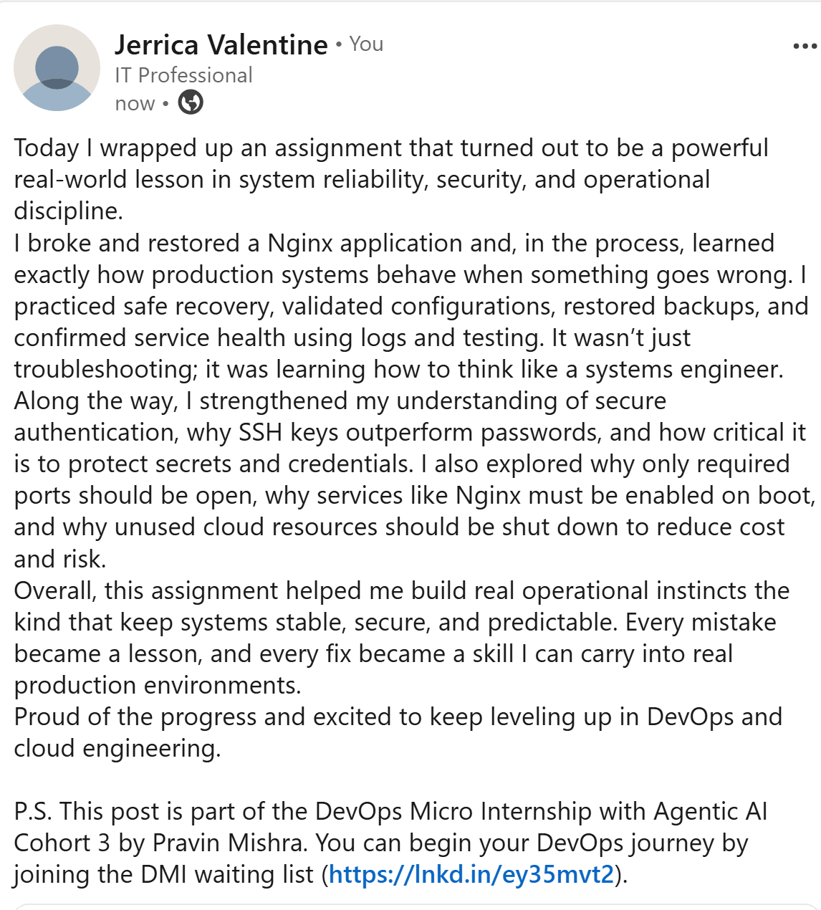

---

# Submission Instructions

- Add all required screenshots in your submission
- Full name must be visible in required screenshots
- Do not expose sensitive information (keys, passwords, account IDs)

---

# Completion Checklist

- [ ] Task 1: Screenshots (browser, ip a, ss -tulpen, ufw status) + Notes answered
- [ ] Task 2: Screenshots (nginx status, nginx -t, ss port 80) + Notes answered
- [ ] Task 3: Screenshots (access log, error log, journalctl) + Notes answered
- [ ] Task 4: Screenshots (uptime, free -h, df -h, du -sh) + Notes answered
- [ ] Task 5: Screenshots (ls html, grep deployed by, grep try_files) + Notes answered
- [ ] Task 6: Screenshots (nginx -t fail, nginx -t pass, curl recovery) + Notes answered
- [ ] Task 7: Screenshots (curl failure, curl recovery) + Notes answered
- [ ] Task 8: Security & Reliability Notes answered
- [ ] LinkedIn post published and URL submitted
- [ ] Full Name visible in all required screenshots
- [ ] No sensitive data exposed

---

## 📌 About DMI & CloudAdvisory

DevOps Micro Internship (DMI) is a project-based DevOps program run by Pravin Mishra (The CloudAdvisory) focused on real-world execution, systems thinking, and career readiness.

It helps learners build strong DevOps foundations with hands-on experience.

---

## 📌 Resources

- 🌐 DMI Official Website: https://pravinmishra.com/dmi  
- 🎓 DevOps for Beginners (Udemy): https://www.udemy.com/course/devops-for-beginners-docker-k8s-cloud-cicd-4-projects/  
- 🎓 Agentic AI DevOps with Claude Code: https://www.udemy.com/course/ultimate-agentic-ai-devops-with-claude-code/  
- 🎓 DevOps with Claude Code: Terraform, EKS, ArgoCD & Helm: https://www.udemy.com/course/devops-with-claude-code-terraform-eks-argocd-helm/  
- ▶️ YouTube Playlist: https://www.youtube.com/playlist?list=PLFeSNDtI4Cho  
- 🔗 Pravin Mishra (LinkedIn): https://www.linkedin.com/in/pravin-mishra-aws-trainer/  
- 🏢 CloudAdvisory (LinkedIn): https://www.linkedin.com/company/thecloudadvisory/

---

*This submission is part of DevOps Micro Internship (DMI) Cohort 3 — Agentic AI Track.*