# Assignment 5 — Bash Script Automation Drill (OPS Checklist)

Part of the DevOps Micro Internship (DMI) Cohort 3 with Agentic AI

---

## Purpose

In this assignment, you will practice Bash scripting by building a series of small automation scripts covering environment setup, variables, arrays, loops, file conditionals, if-else logic, and functions. These scripts form the foundation of real-world Linux automation used in DevOps, cloud, and production support environments.

---

# Task 1 — Bash Environment & Workspace Setup

## Goal

Verify that Bash is available on your system and create a clean workspace for this assignment.

### Evidence

#### Screenshot 1 — Output of `echo $SHELL` and `bash --version`

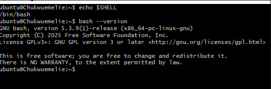

---

#### Screenshot 2 — Output of `pwd` and `ls -lah` showing the scripts directory

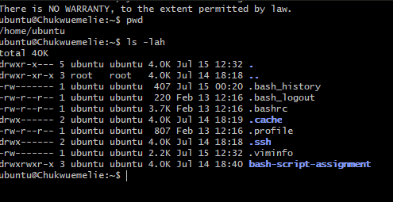

---

### Notes

Answer the following in your own words:

**1. What is Bash?**

What Bash is
A shell: Bash is the program that sits between you and the operating system kernel, letting you type commands (like ls, cd, grep) and see results.

---

**2. What is the difference between shell and Bash?**

A shell is the general term for any program that interprets commands and interacts with the operating system. Bash is one specific type of shell — the most common one on Linux — that adds extra features like command history, tab completion, and advanced scripting. In other words, Bash is a shell, but not all shells are Bash.

---

**3. Why is it important to confirm the Bash version before writing scripts?**

Different Bash versions support different features, syntax rules, and built‑in behaviors. If you write a script using features from a newer Bash version but run it on an older one, the script may break, throw errors, or behave unpredictably. Confirming the Bash version ensures your script is compatible with the environment where it will run, making it reliable, portable, and safe to use across different systems.

---

# Task 2 — Your First Bash Script

## Goal

Create your first Bash script, make it executable, and run it from the terminal.

### Evidence

#### Screenshot 1 — Content of `first-script.sh`

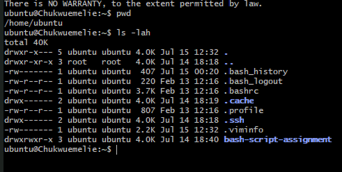

---

#### Screenshot 2 — Output of `./first-script.sh`

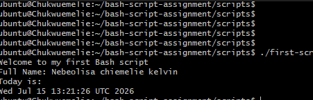

---

#### Screenshot 3 — Output of `ls -l first-script.sh` showing executable permission

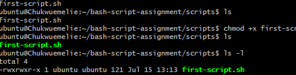

---

### Notes

Answer the following in your own words:

**1. What is the purpose of `#!/bin/bash`?**

#!/bin/bash is a shebang that tells the system to run the script using Bash, ensuring consistent behavior and preventing errors caused by other shells.

---

**2. Why do we use `chmod +x` before running a script?**

chmod +x gives a script execute permission, allowing the operating system to run it as a program. Without this permission, the script is treated as plain text and cannot be executed directly. Adding the execute bit also enables the system to follow the shebang (#!/bin/bash) so the script runs with the correct interpreter.

---

**3. What is the difference between running a script using `./script.sh` and `bash script.sh`?**

./script.sh runs the script as an executable, using the interpreter in the shebang.

bash script.sh runs the script with Bash, ignoring the shebang and not requiring execute permission.

---

# Task 3 — Variables: User Information Script

## Goal

Use variables to store and display user-related information.

### Evidence

#### Screenshot 1 — Content of `user-info.sh`

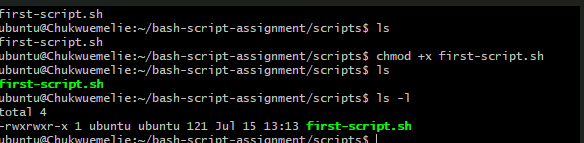

---

#### Screenshot 2 — Output of `./user-info.sh`

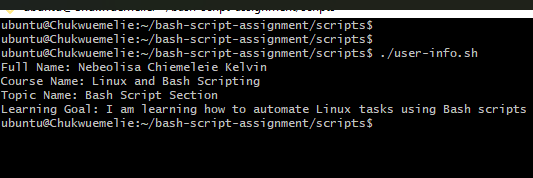

---

### Notes

Answer the following in your own words:

**1. What is a variable in Bash?**

A variable is a way to store information  like text, numbers, filenames, or command results  so your script can reuse it.

---

**2. Why should we avoid spaces around the `=` sign when creating variables?**

Bash does not allow spaces around the = when assigning variables because spaces make Bash interpret the command incorrectly.

---

**3. How do you access the value stored inside a Bash variable?**

You access the value stored in a Bash variable by placing a $ in front of its name.

---

# Task 4 — Arrays & Loops: Tools Checklist Script

## Goal

Use arrays and loops to print a checklist of tools used in Bash scripting.

### Evidence

#### Screenshot 1 — Content of `tools-checklist.sh`

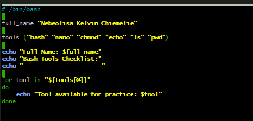

---

#### Screenshot 2 — Output of `./tools-checklist.sh`

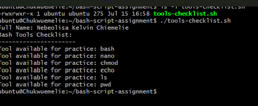
---

### Notes

Answer the following in your own words:

**1. What is an array in Bash?**

In Bash, an array is a single variable that holds multiple values, each stored at a numeric (or string) index so you can access and manipulate them individually.

---

**2. Why are arrays useful in scripts?**

Arrays are useful in scripts because they let you treat a related group of values as a single, structured variable instead of juggling many separate variables or fragile string lists.

---

**3. What does `"${tools[@]}"` mean?**

"${tools[@]}" is the standard Bash way to expand all elements of the tools array as separate, safely quoted words.

---

**4. What is the purpose of the `for` loop in this script?**

In Bash, a for loop is a control structure that repeats a block of commands for each item in a list (or each element of an array, or each word from a command’s output).

---

# Task 5 — Loops: Number Counter Script

## Goal

Use loops to repeat a task multiple times.

### Evidence

#### Screenshot 1 — Content of `counter.sh`

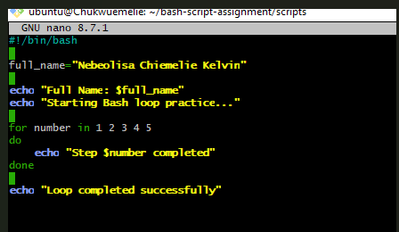

---

#### Screenshot 2 — Output of `./counter.sh`

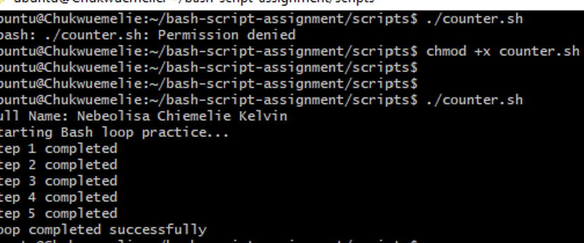

---

### Notes

Answer the following in your own words:

**1. What is a loop?**

A loop is a programming structure that lets you repeat a set of commands multiple times until a certain condition is met.

---

**2. Why do we use loops in Bash scripting?**

 In Bash, loops help automate repetitive tasks so you don’t have to write the same command over and over.

---

**3. How many times did the loop run in your script?**

The loop ran 5 times. 

---

**4. What would you change if you wanted the loop to run 10 times?**

To make a loop run 10 times, you change the range or the condition so it repeats exactly ten iterations. 

---

# Task 6 — Files & Conditionals: File Validation Script

## Goal

Use file checks and conditionals to verify whether files and directories exist.

### Evidence

#### Screenshot 1 — Output of `ls -lah ../test-folder`

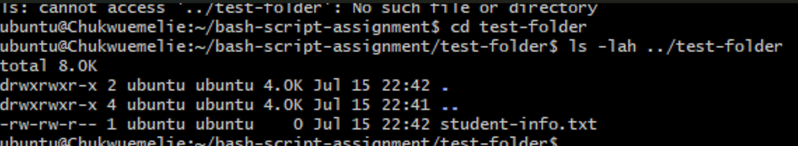

---

#### Screenshot 2 — Content of `file-check.sh`

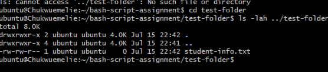

---

#### Screenshot 3 — Output of `./file-check.sh`

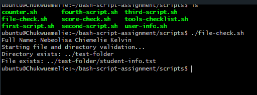

---

### Notes

Answer the following in your own words:

**1. What does `-d` check in Bash?**

-d is a test operator in Bash that checks whether a given path is a directory.
---

**2. What does `-f` check in Bash?**

-f is one of Bash’s file‑test operators, and it checks whether a given path is an existing regular file.

---

**3. Why should file and directory paths be stored in variables?**

Storing file and directory paths in variables makes your Bash scripts cleaner, safer, and easier to maintain. Here’s the tight, useful explanation.

---

**4. What happens if the file does not exist?**

If the file doesn’t exist, -f returns false, and the if block does not run.

---

# Task 7 — Conditionals: Pass or Retry Script

## Goal

Use if-else conditionals to make decisions based on a variable value.

### Evidence

#### Screenshot 1 — Content of `score-check.sh` with `score=85`

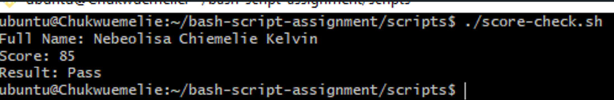

---

#### Screenshot 2 — Output showing `Result: Pass`

---

#### Screenshot 3 — Content of `score-check.sh` with `score=55`

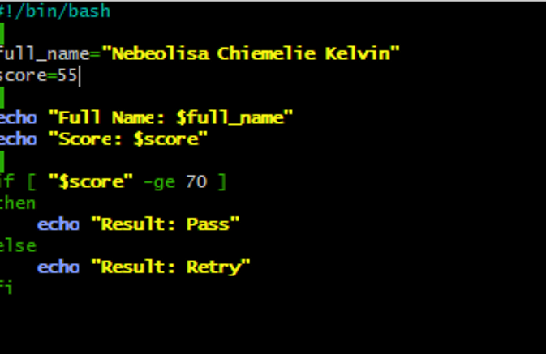

---

#### Screenshot 4 — Output showing `Result: Retry`

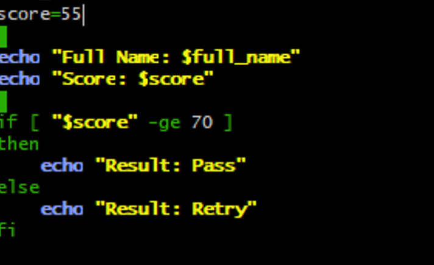

---

### Notes

Answer the following in your own words:

**1. What is the purpose of if-else in Bash?**

An if‑else statement in Bash lets your script make decisions it chooses one action if a condition is true and a different action if it’s false.

---

**2. What does `-ge` mean?**

-ge checks whether the number on the left is greater than or equal to the number on the right.

---

**3. Why should conditions be tested with different values?**

Conditions should be tested with different values because it’s the only way to prove your logic actually works in all situations, not just the “happy path.”

---

**4. How can conditionals help in automation scripts?**

Conditionals are the decision‑making engine of automation. They let your script react to real‑world situations instead of blindly running the same commands every time.

---

# Task 8 — Functions: Final Bash Automation Script

## Goal

Create a final Bash script using functions to organize reusable code.

### Evidence

#### Screenshot 1 — Content of `final-automation.sh`

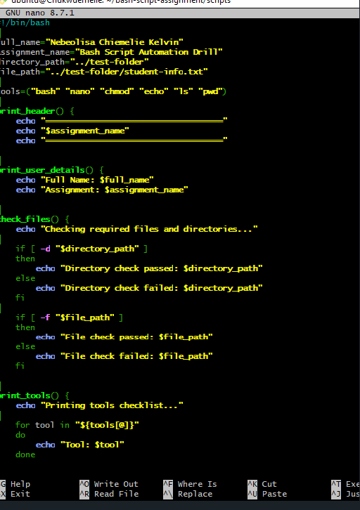

---

#### Screenshot 2 — Output of `./final-automation.sh`

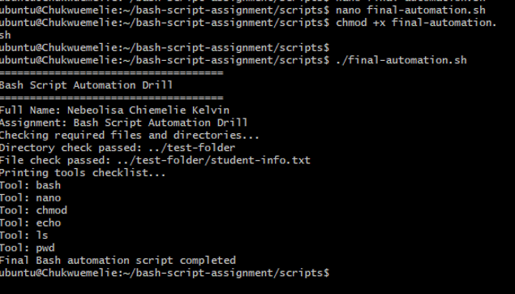

---

#### Screenshot 3 — Output of `ls -lah` showing all created scripts

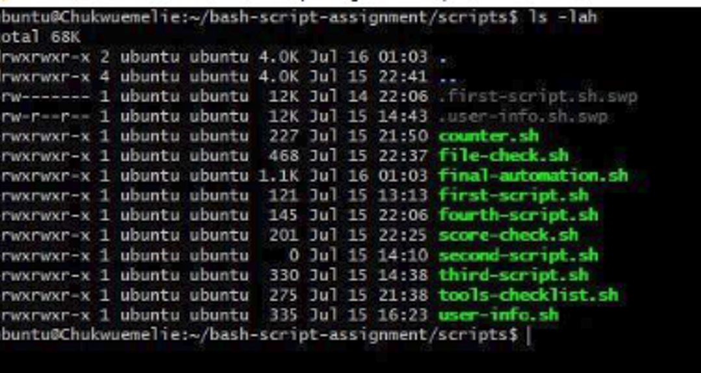

---

### Notes

Answer the following in your own words:

**1. What is a function in Bash?**

A function in Bash is a named block of code that you can reuse anywhere in your script. Instead of repeating the same commands over and over, you put them inside a function and call it whenever you need that behavior.

---

**2. Why are functions useful in scripts?**

Functions are useful in scripts because they turn messy, repetitive code into clean, reusable, reliable building blocks. They’re one of the biggest upgrades you can make as you move from simple Bash scripts to real automation.

---

**3. Which functions did you create in this script?**

Functions are useful in scripts because they turn messy, repetitive code into clean, reusable, reliable building blocks.

---

**4. How does this final script combine variables, arrays, loops, conditionals, files, and functions?**

Variables hold paths, counters, filenames, or configuration settings.

---

# LinkedIn Post (Required)

## Evidence

#### LinkedIn Post URL

Paste your LinkedIn post URL here:

`Add your URL here`

---

#### Screenshot — Published LinkedIn post

Add your screenshot here.

---

# Submission Instructions

- Add all required screenshots in your submission
- Full name must be visible in required screenshots
- All script files must be created and run successfully
- Required notes must be answered clearly for every task
- Do not expose sensitive information (keys, passwords, credentials)

---

# Completion Checklist

- [ ] Task 1: Environment setup verified, workspace created (Screenshots 1–2, Notes answered)
- [ ] Task 2: First script created, executed, permissions verified (Screenshots 1–3, Notes answered)
- [ ] Task 3: Variables script created and run (Screenshots 1–2, Notes answered)
- [ ] Task 4: Arrays and loops script created and run (Screenshots 1–2, Notes answered)
- [ ] Task 5: Counter loop script created and run (Screenshots 1–2, Notes answered)
- [ ] Task 6: File validation script created and run (Screenshots 1–3, Notes answered)
- [ ] Task 7: Pass/Retry conditional script tested with both values (Screenshots 1–4, Notes answered)
- [ ] Task 8: Final automation script created and run (Screenshots 1–3, Notes answered)
- [ ] All scripts run without errors
- [ ] Full Name visible in all required screenshots
- [ ] LinkedIn post published and URL submitted
- [ ] No sensitive data exposed

---

## 📌 About DMI & CloudAdvisory

DevOps Micro Internship (DMI) is a project-based DevOps program run by Pravin Mishra (The CloudAdvisory) focused on real-world execution, systems thinking, and career readiness.

It helps learners build strong DevOps foundations with hands-on experience.

---

## 📌 Resources

- 🌐 DMI Official Website: https://pravinmishra.com/dmi  
- 🎓 DevOps for Beginners (Udemy): https://www.udemy.com/course/devops-for-beginners-docker-k8s-cloud-cicd-4-projects/  
- 🎓 Agentic AI DevOps with Claude Code: https://www.udemy.com/course/ultimate-agentic-ai-devops-with-claude-code/  
- 🎓 DevOps with Claude Code: Terraform, EKS, ArgoCD & Helm: https://www.udemy.com/course/devops-with-claude-code-terraform-eks-argocd-helm/  
- ▶️ YouTube Playlist: https://www.youtube.com/playlist?list=PLFeSNDtI4Cho  
- 🔗 Pravin Mishra (LinkedIn): https://www.linkedin.com/in/pravin-mishra-aws-trainer/  
- 🏢 CloudAdvisory (LinkedIn): https://www.linkedin.com/company/thecloudadvisory/

---

*This submission is part of DevOps Micro Internship (DMI) Cohort 3 — Agentic AI Track.*