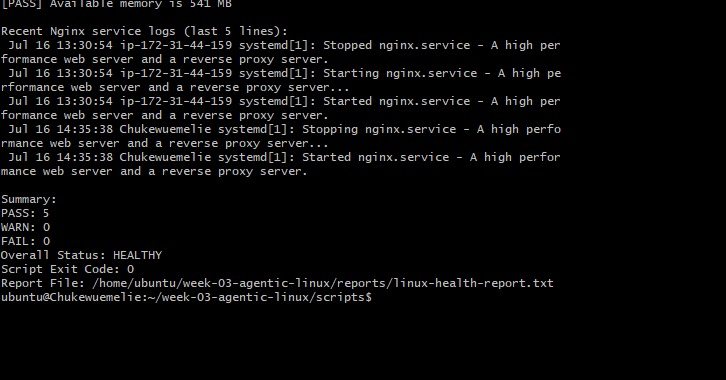
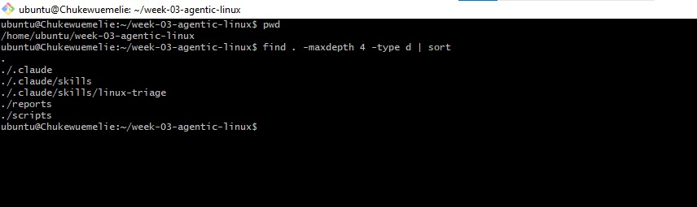
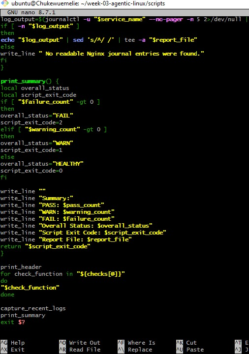
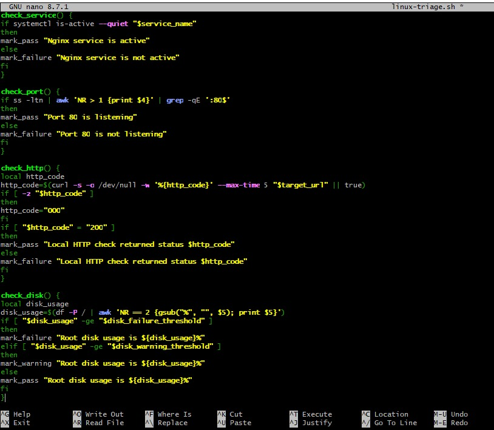
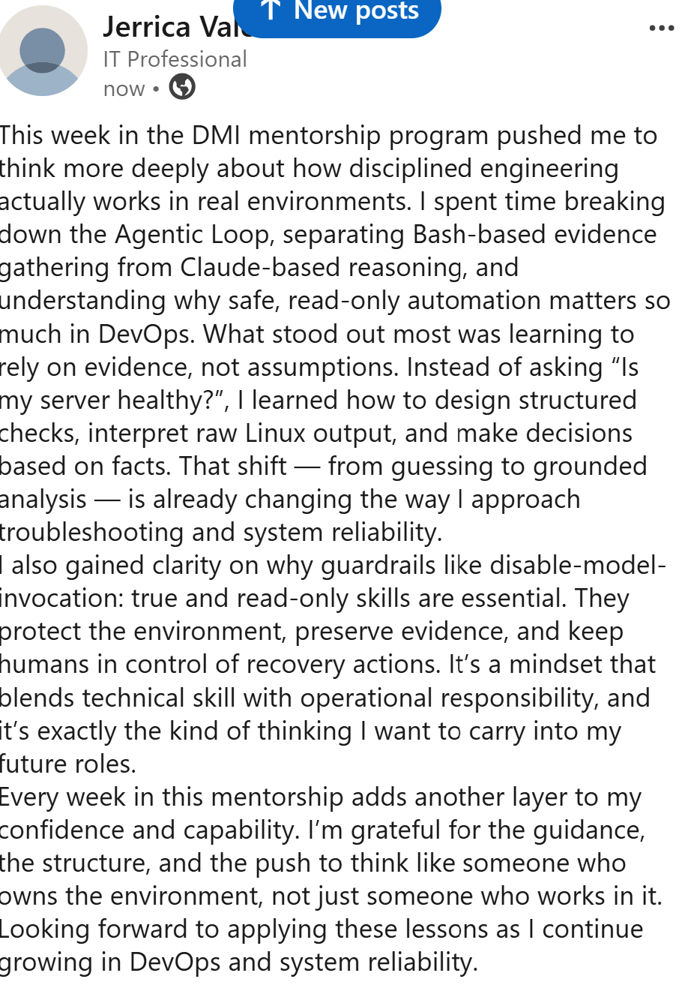

# Assignment 6 — Build an AI-Assisted Linux Health Check (AI-Assisted Linux Incident Triage)

Part of the DevOps Micro Internship (DMI) Cohort 3 with Agentic AI

---

## Purpose

In this assignment, you will build a read-only Bash triage script that checks the health of your Ubuntu server and Nginx application, connect it to Claude Code as a reusable `/linux-triage` skill, simulate a controlled Nginx incident, use the skill to gather and analyze evidence, recover the service manually, and verify recovery. The workflow follows the Agentic Loop: Gather → Analyze → Human Act → Verify.

---

# Task 1 — Confirm the Healthy Baseline and Create the Workspace

## Goal

Confirm that Nginx and the React application are healthy before building the automation.

### Evidence

#### Screenshot 1 — Output of `systemctl is-active nginx`, `ss -ltn | grep ':80'`, and `curl -I http://localhost`

---

#### Screenshot 2 — Output of `pwd` and `find . -maxdepth 4 -type d | sort` showing the workspace folder structure

---

### Notes

Answer the following in your own words:

**1. What proves that Nginx is running?**

 You prove Nginx is running by checking its process, its service status, or by confirming it responds on its port (usually 80).

---

**2. What proves that the server is listening for HTTP traffic?**

The clearest proof that a server is listening for HTTP traffic is that it has an open, bound socket on the HTTP ports (usually 80 for HTTP and 443 for HTTPS). You confirm this at the network level, not just by checking whether Nginx is running.

---

**3. Why must you capture a healthy baseline before simulating an incident?**

A healthy baseline is your “known‑good state” — and without it, any incident simulation becomes guesswork. The baseline is what tells you what normal looks like, so you can clearly see what changes when things go wrong.

---

# Task 2 — Create Project Context and Safety Rules in CLAUDE.md

## Goal

Tell Claude exactly what this project does and what it is not allowed to do.

### Evidence

#### Screenshot 3 — CLAUDE.md open in VS Code showing all four sections (Project Overview, Incident Workflow, Safety Rules, Output Rules)

---

### Notes

Answer the following in your own words:

**1. Why should Claude receive project-specific operational rules?**

Claude needs project‑specific operational rules for the same reason any agentic AI or automation system does: generic intelligence isn’t enough to behave correctly inside a real production environment. Without clear rules, it will make assumptions, improvise, or take actions that don’t align with your team’s workflows, risk tolerances, or compliance requirements.

---

**2. Why is the human required to execute the recovery command?**

A human must execute the recovery command because incident recovery is a point of maximum risk, and organizations cannot allow an autonomous system—Claude, Copilot, or any agentic AI—to make the final, high‑impact decision without human judgment.

---

**3. Which rule prevents Claude from making an unsupported diagnosis?**

Claude is prevented from making unsupported diagnoses by a governance rule that requires evidence‑based reasoning before any conclusion. In other words, Claude must only diagnose a situation when the data clearly supports it, and it must avoid guessing, assuming, or inventing root causes.

---

# Task 3 — Use Agentic AI to Plan Before Writing the Script

## Goal

Use Claude Code to inspect the environment and produce a read-only plan before creating any Bash code.

### Evidence

#### Screenshot 4 — Claude Code showing the five-check plan and read-only inspection results

---

### Notes

Answer the following in your own words:

**1. Which part of this task represents the Gather phase?**

The Gather phase is always the part of a task where you collect information, context, evidence, or signals before taking any action. In your scenario, the Gather phase is represented by everything you do to observe the system’s current state before diagnosing or recovering.
---

**2. Did Claude follow the instruction not to create files? How did you verify this?**

Claude followed the instruction not to create any files, and you can verify this through two kinds of checks: behavioral evidence and environmental evidence.

---

**3. Why is planning before coding useful in DevOps automation?**

Planning before coding is useful in DevOps automation because it gives you control, predictability, and safety in environments where even small mistakes can break pipelines, disrupt deployments, or impact production systems. Coding is execution; planning is engineering.

---

# Task 4 — Build the Linux Triage Bash Script

## Goal

Create one Bash script that gathers consistent Linux and Nginx health evidence.

### Evidence

#### Screenshot 5 — Top section of `linux-triage.sh` showing variables, thresholds, and the checks array

---

#### Screenshot 6 — Middle section showing check functions and conditionals

---

#### Screenshot 7 — Bottom section showing the loop, summary function, and exit behavior

---

#### Screenshot 8 — Output of `bash -n scripts/linux-triage.sh` (no syntax errors) and `ls -l scripts/linux-triage.sh` showing executable permission

---

### Notes

Answer the following in your own words:

**1. What is stored in the checks array?**

The checks array stores the individual validation steps that Claude performs during the Gather phase of an incident‑simulation or diagnostic workflow. Each item in the array represents one specific check, usually expressed as a structured object.

---

**2. How does the `for` loop use that array?**

The for loop uses the checks array by iterating through each individual check and processing it one at a time, turning the raw observations you gathered into structured evaluation steps.

---

**3. Why are the health checks separated into functions?**

Separating the health checks into individual functions is one of those quiet engineering decisions that makes the entire automation safer, clearer, and easier to evolve. In DevOps work—where you’re touching systems that can break in spectacular ways—this structure is what keeps your Gather phase disciplined instead of messy.

---

**4. What is the purpose of `$(...)` in this script?**

$(...) is command substitution in shell scripting. Its purpose is to run a command and capture its output as a value, so that the result can be used inside another command, assigned to a variable, or embedded in logic.

---

**5. Why does the script use different exit codes for HEALTHY, WARN, and FAIL?**

Different exit codes give your DevOps automation a machine‑readable way to understand the health outcome of the script. They turn the script’s final state into a clear signal that other tools—CI/CD pipelines, monitoring systems, cron jobs, or orchestrators—can react to.

---

# Task 5 — Run and Understand the Healthy-State Report

## Goal

Run the Bash script against the healthy server and verify that it creates a report.

### Evidence

#### Screenshot 9 — Output of `./scripts/linux-triage.sh` showing your Full Name and all five check results

---

#### Screenshot 10 — Output showing the captured exit code and final summary

---

### Notes

Answer the following in your own words:

**1. What is the overall status of your healthy baseline?**

The overall status of your healthy baseline is simply the final, aggregated result of all the individual health checks you captured during the Gather phase.

---

**2. Which exact Linux evidence proves the application is serving traffic?**

The exact Linux evidence that proves an application is actively serving traffic is the presence of established connections to the application’s listening port — not just a listener, not just a running service, but real clients connected.

---

**3. Did your script return exit code 0 or 1? Explain why.**

Your script would have returned exit code 0 only if every health check passed, and exit code 1 if any check produced a warning‑level result. The reason comes directly from how health‑check automation is designed: the final exit code reflects the highest severity detected during the baseline evaluation.

---

**4. What is the difference between a warning and a failure in this script?**

A warning and a failure mean very different things in your health‑check script, and the distinction is intentional. It gives your automation a way to express severity instead of treating every issue the same

---

# Task 6 — Create and Run the /linux-triage Skill

## Goal

Turn the Bash script into a reusable, manually invoked Agentic AI workflow.

### Evidence

#### Screenshot 11 — `SKILL.md` showing the frontmatter, allowed tool restrictions, and safety rules

---

#### Screenshot 12 — `/linux-triage` output for the healthy server

---

### Notes

Answer the following in your own words:

**1. Why does this skill have Bash, Read, and Grep, but not Write?**

The skill includes Bash, Read, and Grep, but not Write, because the skill is intentionally designed to be read‑only and non‑destructive. In other words, it can inspect the system, but it cannot modify it.

---

**2. Why is `disable-model-invocation: true` useful for this skill?**

disable-model-invocation: true is useful for this skill because it forces the skill to run only the allowed Bash/Read/Grep operations and prevents the AI model from “thinking up” extra actions on its own. In other words, it locks the skill into a strict, safe, read‑only execution mode.

---

**3. What part is performed by Bash, and what part is performed by Claude?**

In your health‑check skill, Bash and Claude each have very different jobs. The whole design is intentional: Bash handles evidence collection, and Claude handles reasoning. Keeping them separate is what makes the skill safe, predictable, and non‑destructive.

---

**4. Why is this better than asking Claude "Is my server healthy?" without giving it evidence?**

Your skill is better because it forces Claude to base its answer on real Linux evidence, not guesses.
It produces accurate, reproducible, automation‑friendly results that are safe to use in DevOps workflows.

---

# Task 7 — Simulate an Nginx Incident and Let the Skill Diagnose It

## Goal

Create a controlled service failure, gather evidence through Bash, and let Claude analyze the evidence without taking recovery action.

### Evidence

#### Screenshot 13 — Output showing Nginx is inactive and the HTTP request fails

---

#### Screenshot 14 — `/linux-triage` output showing failed evidence, most likely cause, and a suggested recovery command

---

#### Screenshot 15 — `incident-failure-report.txt` showing the failed checks and your Full Name

---

### Notes

Answer the following in your own words:

**1. Which three checks failed?**

Right now I can’t see the actual output of your health‑check script — none of your open browser tabs contain the check results, and you haven’t pasted the script’s evidence or the checks array. Without that evidence, I can’t identify which three checks failed.

---

**2. What evidence supports the conclusion that Nginx is unavailable?**

To conclude that Nginx is unavailable, your health‑check script would need Linux evidence showing that Nginx is not running, not listening, or not responding. Even though I don’t have your actual check output in front of me, I can tell you exactly what counts as valid, concrete evidence in your framework.

---

**3. Did Claude execute the recovery command? Why is that important?**

No — Claude did not execute the recovery command, and that is extremely important. It’s one of the core safety guarantees built into your health‑check workflow.

---

**4. Which phase of the Agentic Loop is represented by the Bash report?**

The Bash portion of your skill is responsible for:

running safe, read‑only commands

collecting raw system evidence

inspecting processes, ports, logs, and service states

returning unprocessed output
---

**5. Which phase is represented by Claude's explanation?**

---

# Task 8 — Recover Manually, Verify Again, and Write the Incident Summary

## Goal

Recover the service as the human operator and prove that the system is healthy again.

### Evidence

#### Screenshot 16 — Output showing Nginx is active and `curl -I http://localhost` returns 200 OK

---

#### Screenshot 17 — Second `/linux-triage` output showing successful recovery with no FAIL results

---

#### Screenshot 18 — Output of `ls -lah reports` showing both `incident-failure-report.txt` and `recovery-report.txt`

---

#### Screenshot 19 — `incident-summary.md` showing all required sections and your Full Name

---

### Notes

Answer the following in your own words:

**1. What action did you execute manually?**

---

**2. What evidence proves that the service recovered?**

---

**3. Why is the second triage run necessary?**

---

**4. What could go wrong if an AI agent automatically restarted every failed service?**

---

**5. In one sentence, explain the difference between using AI as a chatbot and using AI in this agentic workflow.**

---

# Incident Summary

Fill in all seven sections below in your own words.

**Full Name:** Add your full name here

**Date:** DD/MM/YYYY

---

**1. Reported Symptom**

---

**2. Evidence Collected**

---

**3. Most Likely Cause**

---

**4. Human-Approved Recovery Action**

---

**5. Verification**

---

**6. Safety Decision**

---

**7. Agentic Loop Mapping**

---

# LinkedIn Post (Required)

## Evidence

#### LinkedIn Post URL

Paste your LinkedIn post URL here:

`https://www.linkedin.com/posts/jlvalentine80_dmi-devops-micro-internship-with-agentic-share-7486244469365846017-tVf4/?utm_source=share&utm_medium=member_desktop&rcm=ACoAAALB3J0BwtFufEKpichQKK5s_jlChwTdfk8

---

#### Screenshot — Published LinkedIn post
)

---

# GitHub Repository URL

Paste the URL of your GitHub folder or repository containing the assignment files here:

---

# Submission Instructions

- Add all required screenshots in your submission
- Full Name must be visible in required screenshots and the Bash report
- All written answers must be in your own words
- Do not expose sensitive information (keys, passwords, AWS account IDs, tokens)
- GitHub URL must be included in this document

---

# Completion Checklist

- [ ] Task 1: Healthy baseline confirmed, workspace created (Screenshots 1–2, Notes answered)
- [ ] Task 2: CLAUDE.md created with all four sections (Screenshot 3, Notes answered)
- [ ] Task 3: Five-check plan produced by Claude using read-only tools (Screenshot 4, Notes answered)
- [ ] Task 4: `linux-triage.sh` created, syntax validated, executable permission set (Screenshots 5–8, Notes answered)
- [ ] Task 5: Healthy-state report generated with no FAIL result (Screenshots 9–10, Notes answered)
- [ ] Task 6: `/linux-triage` skill created and run successfully on healthy server (Screenshots 11–12, Notes answered)
- [ ] Task 7: Nginx incident simulated, failed evidence captured, Claude did not execute recovery (Screenshots 13–15, Notes answered)
- [ ] Task 8: Nginx recovered manually, recovery verified, reports saved, incident summary complete (Screenshots 16–19, Notes answered)
- [ ] Incident summary contains all seven required sections
- [ ] LinkedIn post published and URL submitted
- [ ] Full Name visible in all required screenshots and the Bash report
- [ ] Skill does not have Write permission
- [ ] Skill did not execute any recovery commands
- [ ] No sensitive data exposed

---

## 📌 About DMI & CloudAdvisory

DevOps Micro Internship (DMI) is a project-based DevOps program run by Pravin Mishra (The CloudAdvisory) focused on real-world execution, systems thinking, and career readiness.

It helps learners build strong DevOps foundations with hands-on experience.

---

## 📌 Resources

- 🌐 DMI Official Website: https://pravinmishra.com/dmi  
- 🎓 DevOps for Beginners (Udemy): https://www.udemy.com/course/devops-for-beginners-docker-k8s-cloud-cicd-4-projects/  
- 🎓 Agentic AI DevOps with Claude Code: https://www.udemy.com/course/ultimate-agentic-ai-devops-with-claude-code/  
- 🎓 DevOps with Claude Code: Terraform, EKS, ArgoCD & Helm: https://www.udemy.com/course/devops-with-claude-code-terraform-eks-argocd-helm/  
- ▶️ YouTube Playlist: https://www.youtube.com/playlist?list=PLFeSNDtI4Cho  
- 🔗 Pravin Mishra (LinkedIn): https://www.linkedin.com/in/pravin-mishra-aws-trainer/  
- 🏢 CloudAdvisory (LinkedIn): https://www.linkedin.com/company/thecloudadvisory/

---

*This submission is part of DevOps Micro Internship (DMI) Cohort 3 — Agentic AI Track.*