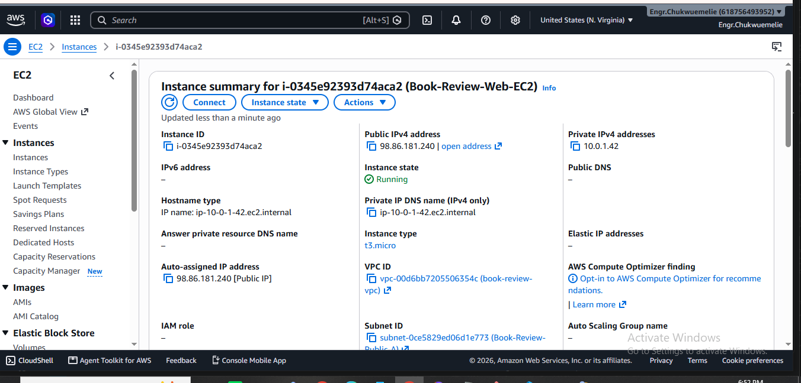
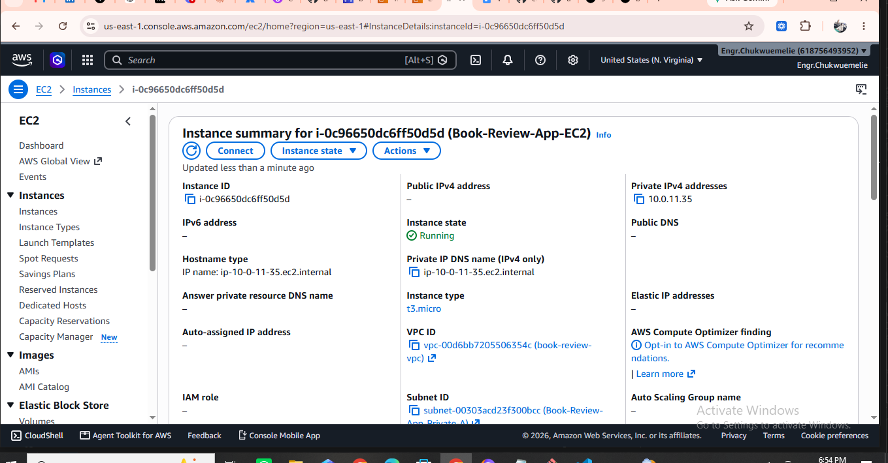
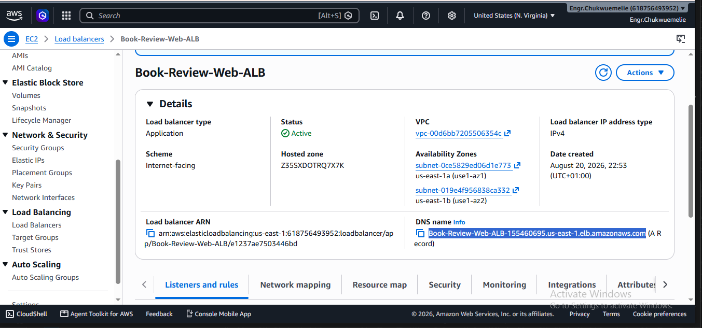
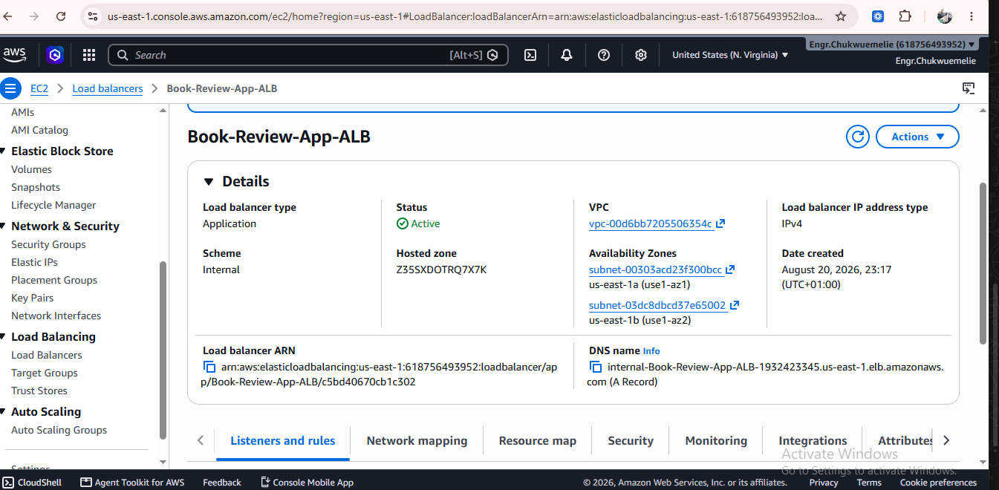
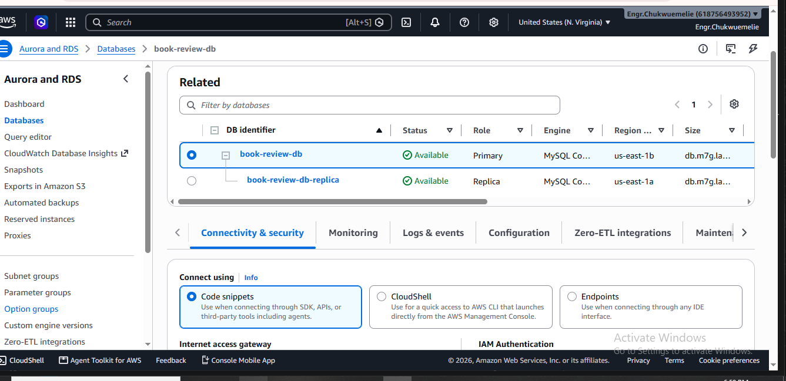
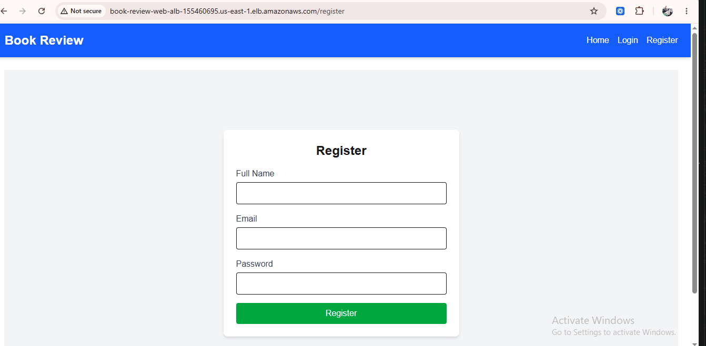
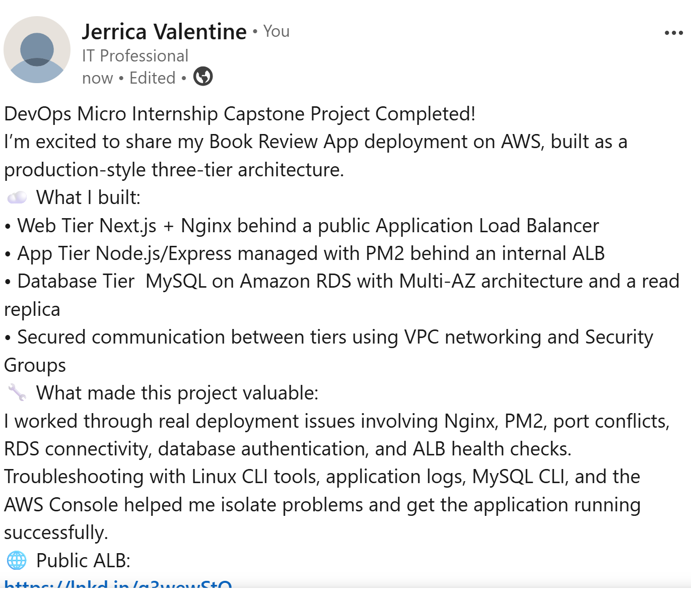

# Assignment 6 — Capstone Assignment — Deploy Book Review App (Three-Tier Architecture) on AWS

Part of the DevOps Micro Internship (DMI) Cohort 3 with Agentic AI

---

## Purpose

This is the most important assignment of the course. You will deploy the Book Review App in a fully production-style three-tier architecture on AWS: a Next.js Web Tier behind Nginx and a public ALB, a private Node.js/Express App Tier behind an internal ALB, and a private Multi-AZ MySQL RDS database with a read replica. You are expected to design, deploy, isolate, debug, and document the result independently.

---

# Task 1 — Architecture Diagram

## Goal

Create an architecture diagram showing the custom VPC (10.0.0.0/16), the six subnets across two Availability Zones (two public Web Tier, two private App Tier, two private Database Tier), the public ALB, Web Tier EC2/Nginx, internal ALB, private App Tier EC2, private Multi-AZ RDS with its read replica, and the permitted traffic flow.

### Evidence

#### Diagram image or link

---

# Task 2 — AWS Region & Services Used

## Goal

Record the AWS Region used and list every AWS service used across networking, compute, load balancing, security, and the database.

### Notes

**Region:**

us-east-1 North Virginia

---

**Services:**

Compute

Amazon EC2 — two instances used: Frontend instance: runs Next.js (port 3000) + nginx as a reverse proxy Backend instance: runs Node.js/Express app (port 3001), managed with PM2

Database

Amazon RDS (MySQL) — managed database instance (book_review_db), connected over SSL from the backend instance

Load Balancing

Elastic Load Balancing (Application Load Balancer) — two ALBs used: Public ALB (book-review-web-alb) — receives internet traffic and routes it to the frontend instance Internal ALB (internal-Book-Review-App-ALB) — routes /api/ requests from the frontend's nginx to the backend instance, keeping the backend off the public internet directly

Networking

Amazon VPC — the private network containing both EC2 instances, RDS, and the internal ALB (evidenced by private IPs such as 10.0.11.35, 10.0.0.53, 10.0.0.42) Subnets — instances and the internal ALB are placed in private subnets (not directly internet-facing); the public ALB sits in public subnets to accept internet traffic and forward it inward Target Groups — register EC2 instances behind each ALB and run health checks to determine routing eligibility

Security

Security Groups — used at every trust boundary: RDS security group — restricts database access to specific EC2 security groups (backend instance) on port 3306 Backend instance security group — allows traffic from the internal ALB Frontend instance security group — allows traffic from the public ALB on port 80 ALB security groups — control what can reach each load balancer (public ALB open to the internet on port 80; internal ALB restricted to VPC traffic)

---

# Task 3 — Public Entry Point

## Goal

Confirm the Book Review App loads through the public ALB DNS name.

### Evidence

#### Public ALB DNS

Paste your public ALB DNS name here:

`http://book-review-web-alb-155460695.us-east-1.elb.amazonaws.com/

---

# Task 4 — Evidence Screenshots

## Goal

Capture visual proof of every tier and load balancer.

### Evidence

#### Web EC2

---

#### App EC2

---

#### Public ALB

---

#### Internal ALB

---

#### RDS + Replica

---

#### App UI proof

---

# Task 5 — Summary

## Goal

Summarize what worked in the final deployment, the issues encountered and how each was fixed, and the tools or sources used to research and debug.

### Notes

**What worked:**

What Worked in the Final Deployment Backend (Node.js/Express) running via PM2 on port 3001, connected to a MySQL RDS instance over SSL, with schema sync and seed data loading successfully on startup. Frontend (Next.js) running locally on port 3000 on its own EC2 instance. Nginx on the frontend instance acting as a reverse proxy: /api/ requests forwarded to the internal ALB, which routes to the backend. All other requests (/) forwarded to the local Next.js app on port 3000. Public ALB (book-review-web-alb) sitting in front of the frontend instance, intended to route public internet traffic in. Security groups configured so the backend's EC2 instance could reach the RDS instance on port 3306.

---

**Issues + fixes:**

502 Bad Gateway from nginx (epicbook app)-Backend Node app wasn't running — nothing listening on port 8080, Located the app directory, ran node server.js manually to see logs, confirmed it started correctly

App died after closing terminal / Ctrl+C- App was run directly in the foreground, not as a persistent process- Installed and configured PM2 to run the app as a managed background service

nginx -t failed with Permission denied on /run/nginx.pid- Command was run without sudo- Re-ran as sudo nginx -t

mysql connection to RDS timed out (ERROR 2003, errno 110)- RDS security group didn't allow inbound traffic from the backend EC2 instance's security group (only the frontend's SG was allowed)- Added an inbound rule on the RDS security group for the backend instance's security group on port 3306

ER_ACCESS_DENIED_ERROR connecting to RDS- Network path was fixed, but credentials (admin password) didn't match RDS master password Verified/corrected the password in .env, confirmed manually via mysql CLI before retrying the app

PM2 showed app as "online" but curl couldn't connect- EADDRINUSE — an earlier manually-run node src/server.js process was still holding port 3001, so the PM2-managed instance was crash-looping in the background- Found and killed the old process (ss -tulpn | grep 3001, kill -9), deleted the stuck PM2 process, and restarted cleanly

nginx -t failed: unexpected end of file, expecting "}" A brace mismatch introduced while editing the config in nano — later, an extra stray closing brace left at the end of the file Reviewed and rewrote the config with exactly two closing braces (for location / and server)

---

**Tools/sources used:**

AWS Console — RDS security groups, target group health checks, ALB listener/target configuration Linux/nginx CLI tools — nginx -t, systemctl, ss -tulpn, ps aux, curl -I, journalctl

PM2 — process management, pm2 start, pm2 status, pm2 logs, pm2 delete

MySQL CLI — direct connection testing to isolate network vs. auth issues

Application's own logs (via node server.js foreground run and pm2 logs) — the most decisive debugging step each time, since they revealed exact error codes (EADDRINUSE, ER_ACCESS_DENIED_ERROR, ECONNREFUSED-style timeouts) rather than guessing from symptoms alone

Project's own "Installation & Configuration Guide.md" — cross-checked against live troubleshooting steps

---

# LinkedIn Post (Required)

## Goal

Publish a LinkedIn post sharing the capstone deployment, including the public ALB DNS (or a redacted screenshot), three to five lines on what you built and why it is production-style, and one proof screenshot.

## Evidence

#### LinkedIn Post URL

Paste your LinkedIn post URL here:

[linkedin](https://lnkd.in/p/gZ8Q8Qh9)

---

#### Screenshot of LinkedIn post

---

# Submission Instructions

- Add all required screenshots and links in your submission
- Do not expose passwords, RDS credentials, connection strings, private keys, or account IDs

---

# Completion Checklist

- [✅] Task 1: Architecture diagram completed
- [✅] Task 2: AWS Region and services documented
- [✅] Task 3: Public ALB DNS confirmed working
- [✅] Task 4: All six evidence screenshots captured (Web Tier, App Tier, both ALBs, RDS + replica, app UI)
- [✅] Task 5: Deployment summary completed (what worked, issues/fixes, tools/sources)
- [✅] LinkedIn post published and URL submitted
- [✅] App Tier and Database Tier confirmed not publicly accessible
- [✅] No sensitive data exposed

---

## 📌 About DMI & CloudAdvisory

DevOps Micro Internship (DMI) is a project-based DevOps program run by Pravin Mishra (The CloudAdvisory) focused on real-world execution, systems thinking, and career readiness.

It helps learners build strong DevOps foundations with hands-on experience.

---

## 📌 Resources

- 🌐 DMI Official Website: https://dmi.pravinmishra.com?utm_source=github&utm_medium=readme  
- 🎓 University: https://university.pravinmishra.com?utm_source=github&utm_medium=readme  
- 💬 Discord Community: https://discord.pravinmishra.com?utm_source=github&utm_medium=readme  
- 📝 Blog: https://dmi.pravinmishra.com/blog?utm_source=github&utm_medium=readme  
- ▶️ YouTube Playlist: https://www.youtube.com/playlist?list=PLFeSNDtI4Cho  
- 🔗 Pravin Mishra (LinkedIn): https://www.linkedin.com/in/pravin-mishra-aws-trainer/  
- 🏢 CloudAdvisory (LinkedIn): https://www.linkedin.com/company/thecloudadvisory/

---

*This submission is part of DevOps Micro Internship (DMI) Cohort 3 — Agentic AI Track.*