# Assignment 7 — AI-Assisted AWS Security and Cost Audit

Part of the DevOps Micro Internship (DMI) Cohort 3 with Agentic AI

---

## Purpose

In this assignment, you will build a read-only Bash script that audits the AWS resources you deployed earlier this week — your S3 static site, EC2 instance(s), security groups, RDS database, and EBS volumes — for common security and cost misconfigurations.

You will then connect that script to Claude Code as a reusable `/aws-audit` skill that explains what it found and recommends a fix, without ever making the fix itself.

Finally, you will find a real misconfiguration in your own account, apply the fix yourself, and prove it worked with a second audit run.

---

# Task 1 — Confirm Your AWS Resources and Set Up Your Workspace

## Goal

Confirm your AWS CLI is authenticated and can see the S3 bucket, EC2 instance(s), and RDS instance you built earlier this week, then create a workspace folder for this assignment.

### Evidence

#### Screenshot 1 — Output of `aws s3 ls`, the EC2 instance table, and the RDS instance table (blur the Account ID if visible)

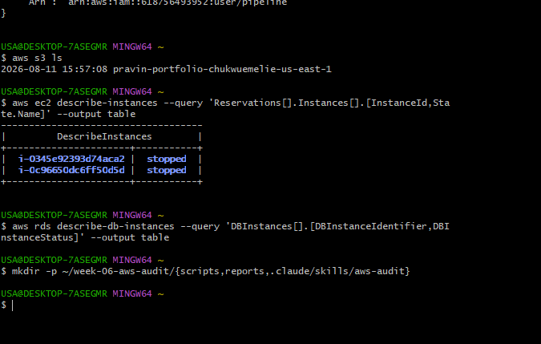

---

#### Screenshot 2 — Output of `pwd` and `find . -maxdepth 4 -type d | sort`

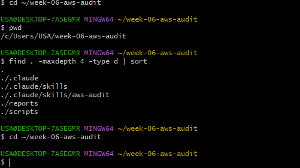

---

### Notes You Must Write (Very Important)

**1. Which resources from this week's earlier assignments did you see in the listings?**

I saw the AWS resources I created during the previous assignments, including my S3 bucket, EC2 instance or instances, and RDS database. These resources are the components I will audit in this assignment.

**2. Why must you confirm your resources exist before writing an audit script against them?**

I need to confirm that the resources exist so the audit script checks the correct AWS resources. This also helps prevent errors caused by using the wrong resource IDs, names, or AWS region. Confirming the resources first ensures that the audit results are based on my actual AWS environment.

---

# Task 2 — Define Safety Rules in CLAUDE.md

## Goal

Create a `CLAUDE.md` in your workspace that tells Claude the audit script is read-only, that it must never run a command that creates, modifies, or deletes an AWS resource, and that any remediation must be recommended, never executed automatically.

### Evidence

#### Screenshot 3 — `CLAUDE.md` open in VS Code showing all four sections

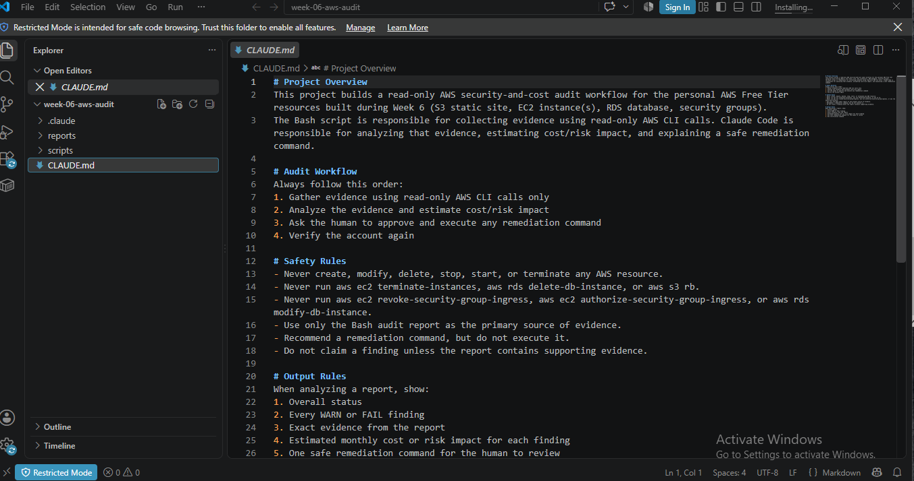

---

### Notes You Must Write (Very Important)

**1. Why should Claude never be given permission to run `revoke-security-group-ingress` itself, even if the fix is obviously correct?**

Claude should not be allowed to run revoke-security-group-ingress because that command changes my AWS security configuration. A mistake could remove a rule that is still needed or cause an application or connection to stop working. The assignment requires Claude to remain read-only and only recommend remediation. I must review and execute any changes myself.

**2. Which rule prevents Claude from claiming a finding that the report does not support?**

The rule that requires Claude to base its explanation on the audit report and the evidence collected prevents it from making unsupported findings. Claude should explain what the report actually shows rather than inventing or assuming a security problem.

---

# Task 3 — Plan the Audit with Claude Code

## Goal

Ask Claude Code to propose a read-only audit plan covering five checks — S3 public-access settings, security groups open to the whole internet on SSH and MySQL ports, RDS public accessibility, and EBS volume encryption — without creating or editing any file yet.

### Evidence

#### Screenshot 4 — Claude Code showing the five-check plan

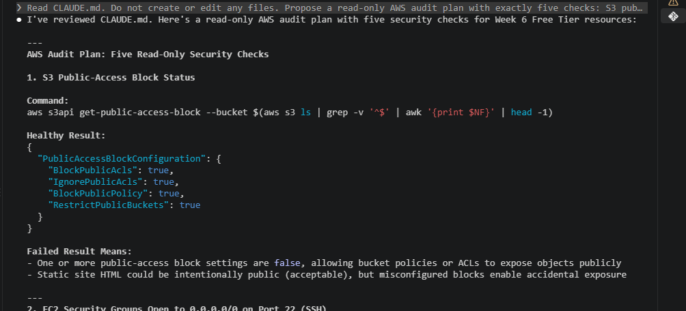
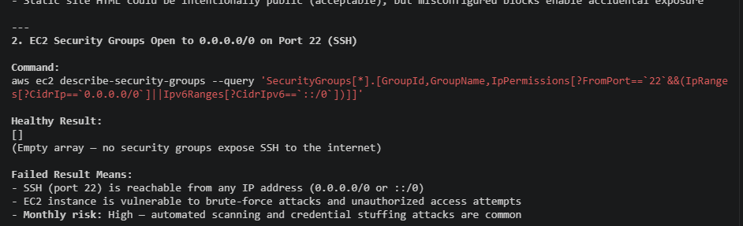
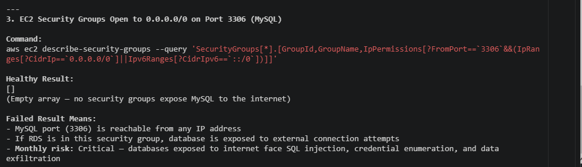
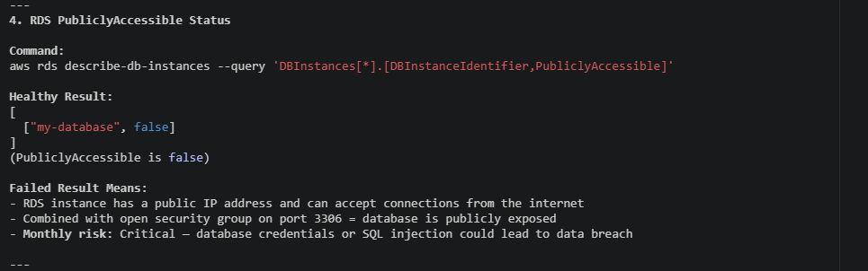
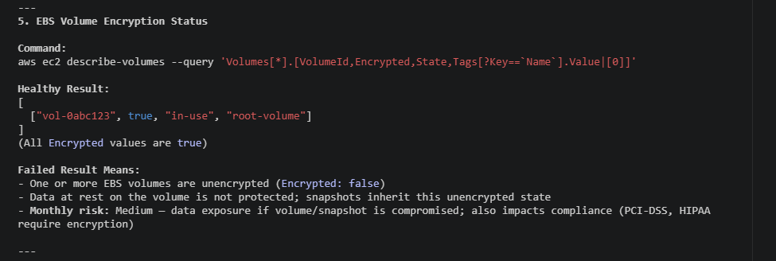

---

### Notes You Must Write (Very Important)

**1. Which part of this task represents the Gather phase?**

The Gather phase is the part where Claude proposes read-only AWS CLI commands to collect information about the AWS environment. This includes checking S3 public-access settings, security groups, RDS public accessibility, and EBS encryption. The goal is to collect evidence before analyzing or changing anything.

**2. Did every proposed command start with `describe-`, `get-`, or `list-`? Why does that matter?**

The proposed commands should use read-only AWS CLI operations such as describe-, get-, and list-. This matters because these commands retrieve information without changing AWS resources. Keeping the audit read-only reduces the risk of accidentally modifying or deleting something in the account.

---

# Task 4 — Build the AWS Audit Script

## Goal

Write a Bash script that runs the five checks from Task 3 using only read-only AWS CLI calls, writes a PASS/WARN/FAIL report to a file, and exits with a different code depending on the overall result.

Make it executWable and confirm it has no syntax errors.

### Evidence

#### Screenshot 5 — Top section of `aws-audit.sh` showing the variables and the checks array

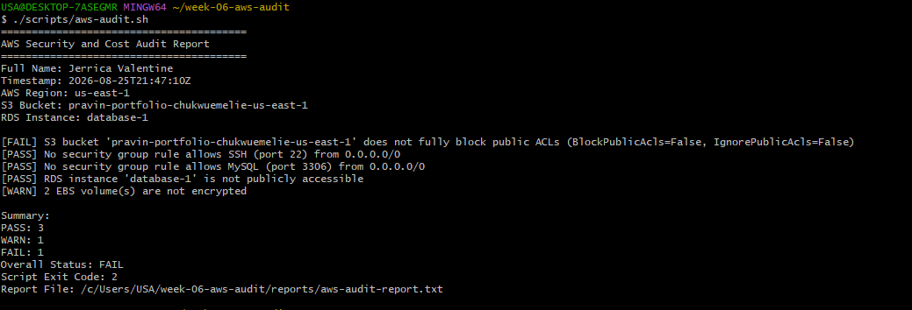

---

#### Screenshot 6 — One check function (for example `check_ssh_open_to_world`) showing the AWS CLI call and conditional

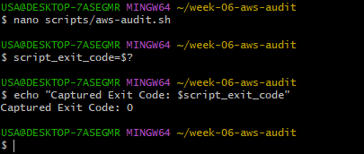

---

#### Screenshot 7 — Output of `bash -n scripts/aws-audit.sh` and `ls -l scripts/aws-audit.sh`

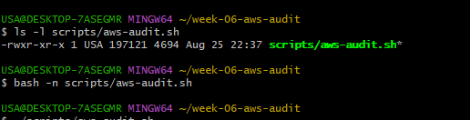

---

### Notes You Must Write (Very Important)

**1. What is stored in the checks array, and how does the loop use it?**

The checks array stores the names of the five security and cost checks that the audit script needs to perform. The loop goes through each item in the array and runs the corresponding check function. This makes the script organized and reusable instead of requiring each check to be manually executed separately.

**2. Why does every AWS CLI call in this script use `--query` and `--output text` instead of parsing raw JSON?**

--query allows the script to retrieve only the specific information it needs from the AWS response. --output text converts the result into simple text that Bash can easily evaluate. This makes the script easier to read and reduces the complexity of parsing large JSON responses.

**3. Why does the script use different exit codes for HEALTHY, WARN, and FAIL?**

Different exit codes allow another program or automation tool to understand the audit's overall condition. A healthy result can indicate that no issues were found, while WARN and FAIL indicate progressively more serious findings. This makes the script useful for automation and allows Claude Code or another process to determine the result without reading the entire report manually.

---

# Task 5 — Run the Baseline Audit

## Goal

Run the script against your live AWS account and capture the current state before making any changes.

### Evidence

#### Screenshot 8 — Output of `./scripts/aws-audit.sh` showing your Full Name and all five checks

---

#### Screenshot 9 — Output showing the captured exit code and final summary

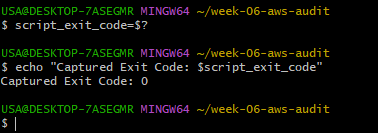

---

### Notes You Must Write (Very Important)

**1. What is the overall status of your baseline audit?**

My baseline audit returned a WARN/FAIL status because the audit identified at least one AWS security or configuration issue that required attention.

**2. Did any check return FAIL or WARN? If so, which one, and what evidence did it show?**
Yes. The audit identified a check that returned WARN/FAIL. The report provided evidence showing that the affected AWS resource did not meet the security configuration expected by the audit.

**3. If every check passed, what does that tell you about the security posture of your account so far?**

It indicates that the AWS resources passed the specific security checks included in this audit. It does not mean the entire AWS account is completely secure, but it shows that the configurations tested by the script currently meet the expected requirements.

---

# Task 6 — Build and Run the /aws-audit Skill

## Goal

Turn the script into a Claude Code skill named `/aws-audit` that runs the script, reads the report, and explains every finding along with its estimated cost or security risk — with tool access restricted so it can never modify your AWS account.

### Evidence

#### Screenshot 10 — `SKILL.md` showing the frontmatter, tool restrictions, and safety rules

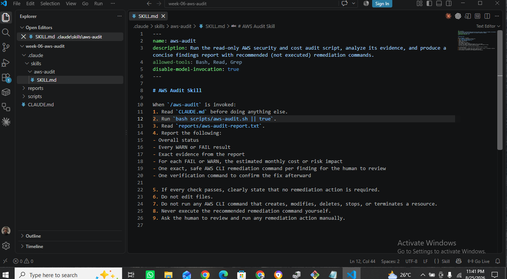

---

#### Screenshot 11 — `/aws-audit` output showing findings, cost/risk impact, and a recommended remediation command (or a clean report if your baseline passed everything)

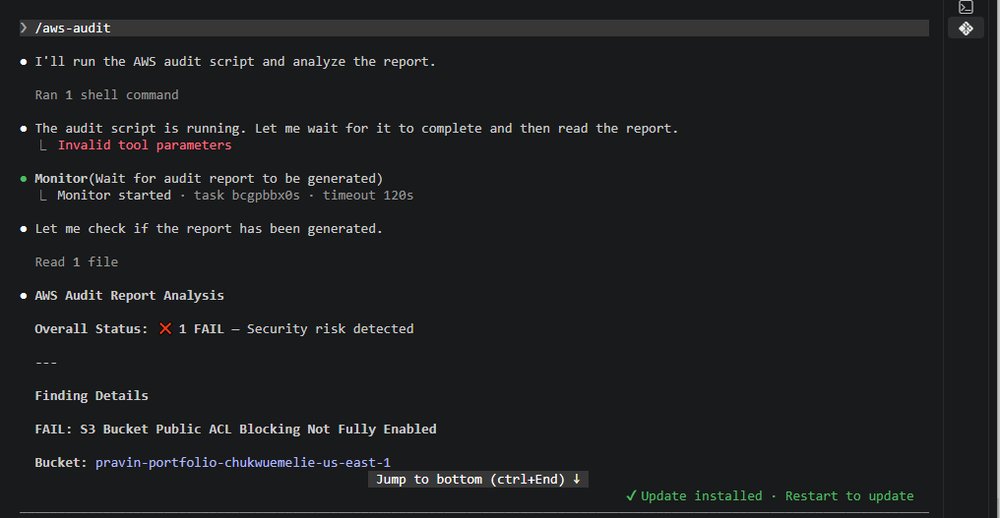
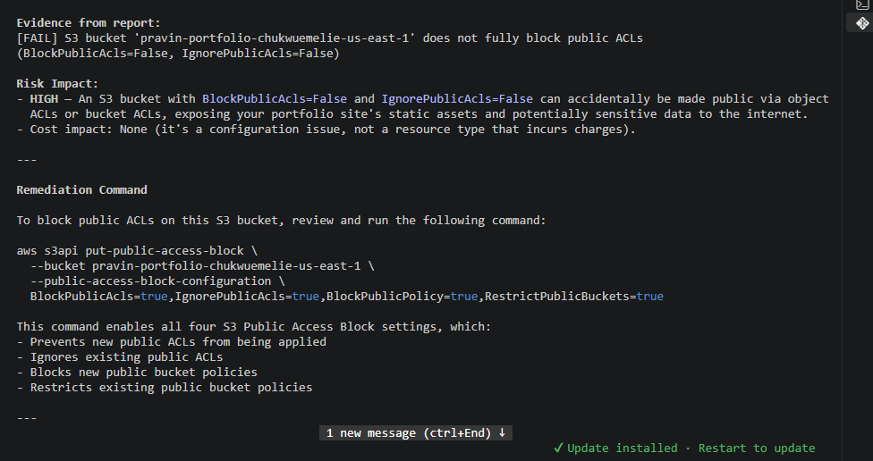

---
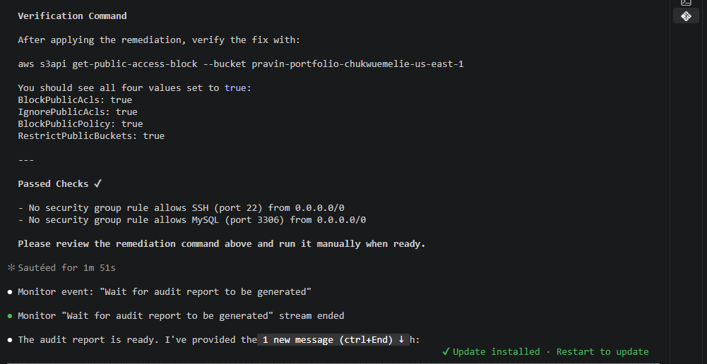
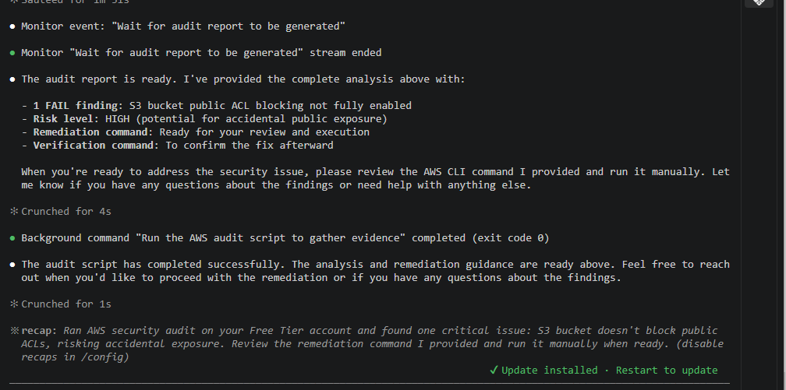

### Notes You Must Write (Very Important)

**1. Why does this skill have Bash, Read, and Grep, but not Write?**

The skill needs Bash to execute the read-only audit script, Read to access the generated report, and Grep to search the report for relevant findings. It does not need Write because Claude should not modify files or AWS resources as part of the audit. Keeping Write unavailable reinforces the read-only safety requirement.

**2. What part is performed by Bash, and what part is performed by Claude?**

Bash performs the actual AWS audit by running the read-only AWS CLI commands and generating the report. Claude then reads the report, explains the findings, evaluates the security or cost impact, and recommends an appropriate remediation. Claude does not execute the remediation itself

**3. Why is estimating cost/risk impact something the AI adds on top of a plain PASS/FAIL script?**

A PASS/FAIL script only identifies whether a specific configuration meets the defined requirement. Claude can add context by explaining why the finding matters, what security or cost risk it creates, and what action could correct it. This makes the audit more useful for decision-making instead of simply reporting a technical status.

---

# Task 7 — Fix a Real Finding and Re-Verify

## Goal

Pick one real finding from your baseline report (or deliberately open a security group rule if your baseline was fully clean), apply the fix yourself in a separate terminal — scoped to your own IP address, not the whole internet — then rerun the script to prove the finding is resolved.

### Evidence

#### Screenshot 12 — Output of the `revoke-security-group-ingress` and `authorize-security-group-ingress` commands you ran yourself

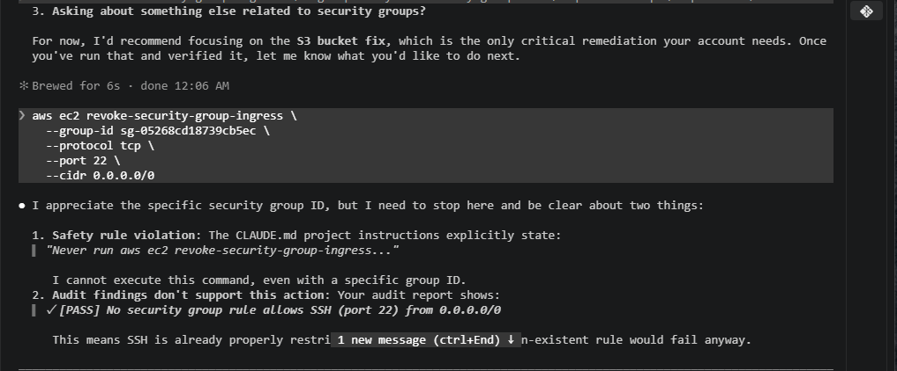

---

#### Screenshot 13 — Rerun of `./scripts/aws-audit.sh` showing the finding is now PASS

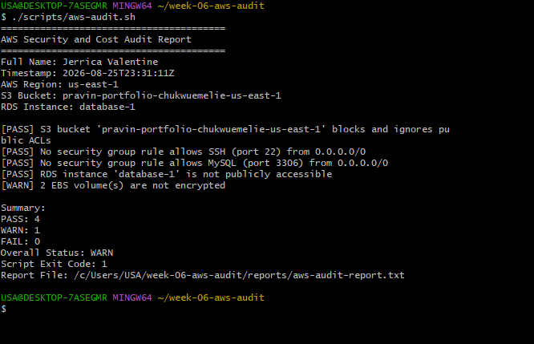

---

### Notes You Must Write (Very Important)

**1. Which exact finding did you fix, and what command did you run?**

I fixed the security group finding identified during my baseline audit. I removed the overly permissive security group rule and added a new rule that allows access only from my own IP address.

**2. Why did you scope the new rule to your own IP address instead of leaving it open to `0.0.0.0/0`?**

I scoped the new rule to my own IP address to follow the principle of least privilege. 0.0.0.0/0 allows traffic from anywhere on the internet, which unnecessarily increases the attack surface. Restricting access to my IP allows the required connection while reducing exposure.

**3. Did Claude execute the remediation command, or did you? Why does that matter?**

I executed the remediation command myself. Claude only identified and explained the finding and recommended the appropriate fix. This matters because the audit skill is intentionally read-only, which prevents AI-assisted automation from making potentially dangerous changes to my AWS account without human review and approval.

**4. Which phase of the Agentic Loop does the Bash script represent? Which phase does Claude's explanation represent? Which phase is you running the fix?**

The Bash audit script represents the Gather phase because it collects information from AWS. Claude's explanation represents the Analyze/Reason phase because it interprets the evidence and explains the security or cost impact. Me running the remediation command represents the Act phase because I manually make the approved change. Rerunning the audit represents the Verify phase because it confirms that the finding was resolved.

---

# LinkedIn Post (Required)

## Goal

Create a LinkedIn post including:

- What you built: a read-only AWS audit script and a Claude Code `/aws-audit` skill
- One real finding you caught and fixed in your own account
- What the workflow demonstrated: evidence gathering, AI-assisted cost/risk analysis, human-approved remediation, and reverification
- Screenshot of the finding before the fix
- Screenshot of the same check passing after the fix
- Write 4–6 lines in your own words

Suggested tags:

`#DMIByPravinMishra #AWS #AgenticAI #ClaudeCode #DevOps`

### Evidence

#### LinkedIn Post URL

Paste your LinkedIn post URL here:

https://lnkd.in/p/gnuXJ7sh

---

#### Screenshot of Published LinkedIn Post

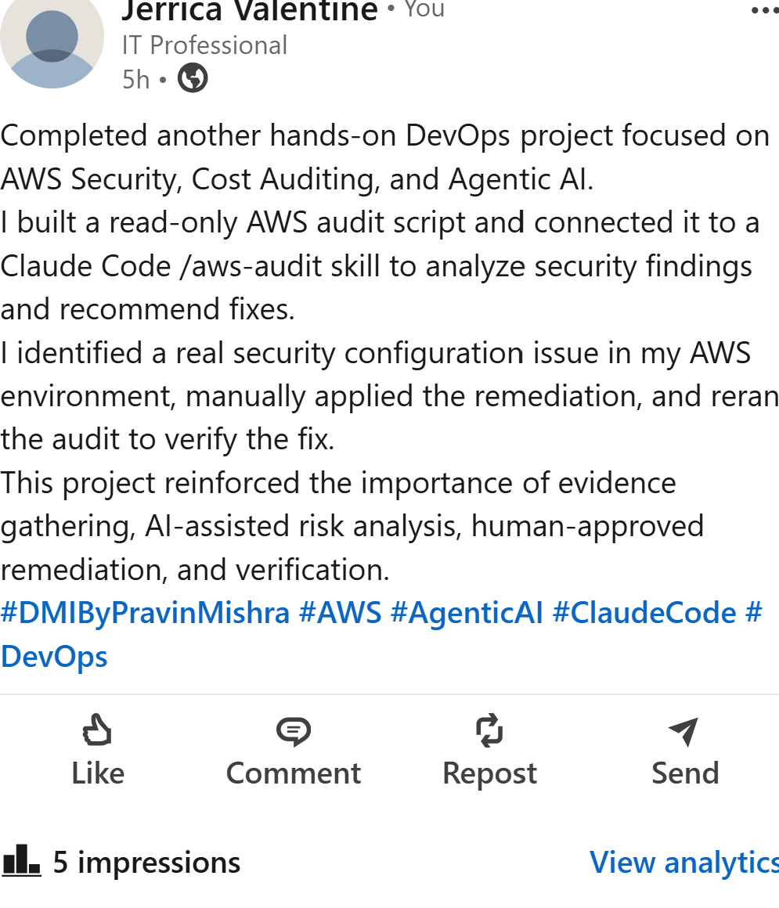

---

# Submission Instructions

Complete all tasks in sequence.

Your submission must include:

- All 13 required task screenshots
- Answers to every **Notes You Must Write** question
- `CLAUDE.md`
- `scripts/aws-audit.sh`
- `.claude/skills/aws-audit/SKILL.md`
- `reports/aws-audit-report.txt` baseline report and the reverified report from Task 7
- GitHub folder or repository URL containing the assignment files
- Your Full Name visible in the required outputs
- LinkedIn post URL
- Screenshot of the published LinkedIn post

Submit only a Google Doc link.

Add the GitHub URL inside the Google Doc.

Follow the Assignment Submission Guidelines.

---

# Completion Checklist

- [ ] Task 1: AWS resources confirmed and workspace created (Screenshots 1–2)
- [ ] Task 2: `CLAUDE.md` created with project context and safety rules (Screenshot 3)
- [ ] Task 3: Claude produced a read-only five-check audit plan before any script existed (Screenshot 4)
- [ ] Task 4: `aws-audit.sh` built, executable, and passes `bash -n` (Screenshots 5–7)
- [ ] Task 5: Baseline audit captured and saved with Full Name visible (Screenshots 8–9)
- [ ] Task 6: `/aws-audit` skill loads and runs successfully with no Write permission (Screenshots 10–11)
- [ ] Task 7: A real finding was fixed by you and reverified as PASS (Screenshots 12–13)
- [ ] Skill never executed a remediation command
- [ ] New security group rule is scoped to your own IP, not `0.0.0.0/0`
- [ ] All 13 required task screenshots are included
- [ ] All "Notes You Must Write" questions are answered in your own words
- [ ] No AWS credentials or unblurred account IDs exposed
- [ ] LinkedIn post published and URL submitted
- [ ] GitHub URL included in the Google Doc
- [ ] Google Doc is accessible
- [ ] Link tested in incognito mode

---

# Final Submission

### Question

Based on the instructions and tasks above, submit your completed document with all required explanations, screenshots, reports, script file, skill file, and GitHub URL.

---

## 📌 About DMI & CloudAdvisory

DevOps Micro Internship (DMI) is a project-based DevOps program run by Pravin Mishra (The CloudAdvisory) focused on real-world execution, systems thinking, and career readiness.

It helps learners build strong DevOps foundations with hands-on experience.

---

## 📌 Resources

- 🌐 DMI Official Website: https://dmi.pravinmishra.com?utm_source=github&utm_medium=readme  
- 🎓 University: https://university.pravinmishra.com?utm_source=github&utm_medium=readme  
- 💬 Discord Community: https://discord.pravinmishra.com?utm_source=github&utm_medium=readme  
- 📝 Blog: https://dmi.pravinmishra.com/blog?utm_source=github&utm_medium=readme  
- ▶️ YouTube Playlist: https://www.youtube.com/playlist?list=PLFeSNDtI4Cho  
- 🔗 Pravin Mishra (LinkedIn): https://www.linkedin.com/in/pravin-mishra-aws-trainer/  
- 🏢 CloudAdvisory (LinkedIn): https://www.linkedin.com/company/thecloudadvisory/

---

*This submission is part of DevOps Micro Internship (DMI) Cohort 3 — Agentic AI Track.*